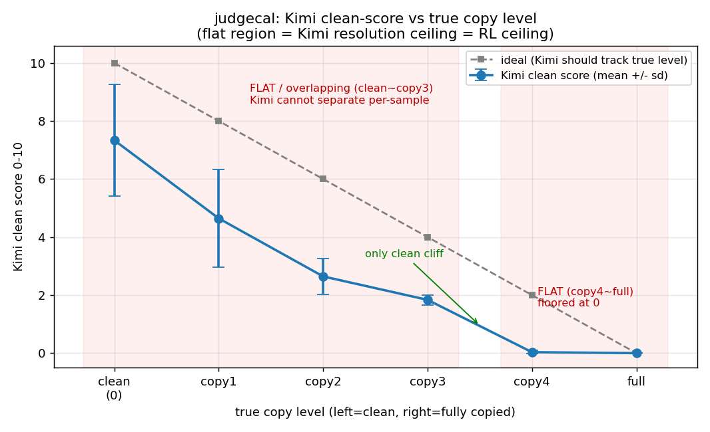
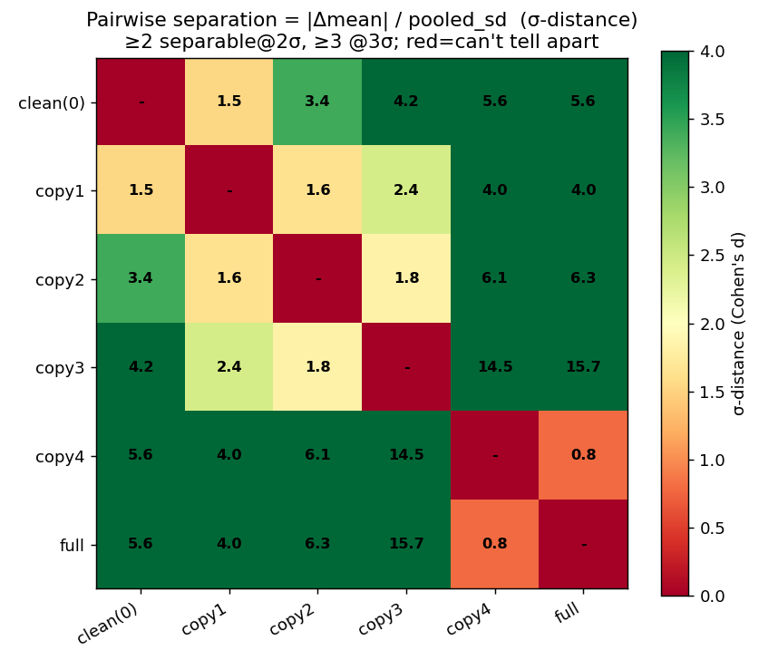

# 32B 税务大模型 · think 去检索腔强化学习 — 实验报告

> 本报告整合自项目全程的实验记录、分析文档与逐阶段验收数据，是重构后的权威版本。
> 配套：干净最终代码见 [`code/`](code/README.md)；历史世代与原始记录见 [`archive/`](archive/README.md)；
> 前置 14B 沙盒见 [`sandbox-14b/`](sandbox-14b/关于本目录.md)；图表在 [`report_figs/`](report_figs/)。

**口径总声明（贯穿全文）**：每个评测数字都标注"谁评的"（规则=确定性正则｜Kimi=DashScope 上的 Kimi-K2.6 大模型裁判｜人=人工抽检）与样本量；
三套验收口径互不相同、数值不可横向比——① V2 三件套（最终结论口径，500 冻结验收）② derag_v4 纯规则 trace 口径（224）③ 14B/早期 humanness 相似度泵口径（已弃）。

## 目录

1. 摘要：一页看懂这个项目
2. 一、项目背景与目标
3. 二、前置沙盒验证（14B）——32B 立项的依据
4. 三、怎么验收：三件套 + 先把裁判标定清楚
5. 四、第一条路径（V1 管线·224 验收）：四轮净≈0，但每次都拆出根因
6. 五、第二条路径（V2/derag2·500 验收）：把测量和信号对准目标，RL 真涨了
7. 六、结果总览（图表 + 谱系 + 数据流）
8. 七、方法论沉淀（给后续项目的 8 条）

---
## 摘要：一页看懂这个项目

**背景（一句话）。** 公司给的 V1（Qwen2.5-32B 税务微调模型，既是被改造对象、又是判答案对错的金标准）的推理过程 `<think>` 里带"检索腔"（"参考问答对1 / 资料显示 / 检索结果表明"这种念手册、查资料的机器腔），公司第二版（V2）想训掉它却训崩了，因此只剩"纯自我改进 RL（强化学习）"这一条可走的路——不引外部教师答案，用模型自己的输出做学习信号。

**最终成果（一句话）。** 在第二条路径（V2/derag2，500 题冻结验收集）上，**DPO（直接偏好优化）相对 RFT 的 think 干净分 +0.155（Kimi 裁判，k=3 取均，N=500，刚过约 0.15 的真涨门槛）=本项目 DPO/GRPO 这条线第一次量出"RL 真涨"（记作 DPO_TRUE_GAIN）**；全链路看，think 干净分从 V1 的 3.140 涨到 DPO 的 4.643（≈4.64，Kimi 评），规则去检索腔通过率从 2.6% 涨到 49.0%（`detect_rag_style` 正则评，确定性）。

**贯穿主线（为什么值得讲）。** 在此之前共四轮 RL（含早期 14B 沙盒与第一条 V1 管线）净提升≈0。**关键判断是：这不是"RL 学不到"，而是"测量仪器/选样口径没对准目标"**——每次拆开都是同一类病：de-RAG 把答案的 grounding（事实依据）连检索腔一起去掉了；reward（奖励）把"答对"和"想得像人"串台、还给错事实发部分分；裁判单遍噪声 σ=0.117 叠加 0.85 封顶把信号淹没；优化的"痕迹"指标里 60% 是 policy_source（合法引法条文号）被误判成痕迹；未注入的分布里好样本质量≈0。证据是 headroom 探针（决定该不该上 RL 的体检）测出 RFT 自救率 X=0.791（Kimi 判，即 79% 病题里"想得干净又不漂答案"的好样本真实存在），说明瓶颈钉死在奖励函数、不在模型能力。把四件事对准目标后就涨了：先标定裁判分辨率 → 只造"大间距对子" → answer-lock（答案锁定，让梯度只作用在 think）→ 词典序硬门防 Goodhart（钻空子刷指标）。结论从"RL 能不能学到"变成"能学到，只剩'别把答案弄漂'这一个工程约束没完全收口"。

**LoRA 谱系（文字版箭头）。**
`base = V1-32B(只读)` → `v2-sft-2σ`（用 k2-930 改写种子、训 7 个 epoch 的冷启动 SFT）→ `v2-rft-2σ-merged`（204 条过 2σ 门的自采样样本，合并成 DPO 底座）→ **`v2-dpo-2σ-merged`（885 条 answer-lock 大间距对子、108 步）★当前最优** → `v2-grpo-warmup`（30 步热身）→ `v2-grpo-online`（在线采样 + Kimi k=2 裁判、90 步）。

**三件套验收结论小表。** 验收口径=一个工具只判一件事：① think 干净分（Kimi-K2.6 裁判，k=3 取均，0–10，唯一靠大模型判"换词复述/结构性照抄"的）；② 规则去检索腔通过率（`detect_rag_style` 正则，确定性，只看表面检索腔词）；③ 答案在池率（`answer_in_v1_pool`，确定性，只查极性/数字/日期有没有漂离 V1，绝不查措辞）。全部 N=500 冻结集。

| 阶段（LoRA） | Kimi think 干净分（k=3，N=500） | 规则去检索腔通过率（N=500） | 答案在池率（N=500） |
|---|---:|---:|---:|
| V1 基线 | 3.140 | 2.6% | 93.8% |
| SFT 冷启动 | 4.408 | 45.4% | 83.0% |
| RFT | 4.489 | 45.6% | 85.0% |
| **DPO（当前最优）** | **4.643** | **49.0%** | **84.6%** |
| GRPO | 4.601 | 50.0% | 83.8% |

读表要点：(a) **V1→SFT 干净分 +1.27 且规则 2.6%→45.4%，是全项目第一次"双真涨"**（Kimi 主观分和规则客观率同向涨，排除 Goodhart）；(b) DPO 相对 RFT +0.155 刚过 ≈0.15 的真涨门（门=约 3×SE，SE≈0.0495，N=500），即 DPO_TRUE_GAIN；(c) **DPO vs GRPO 三件套差值全落噪声带内（统计打平）**：干净分 4.643 vs 4.601（门 0.15）、规则 49.0% vs 50.0%（SE≈2.2pp）、在池 84.6% vs 83.8%（SE≈1.6pp），格式失败各 2/500，不宜判 GRPO 优于或劣于 DPO；(d) **唯一未收口的工程约束**：DPO 在池率 84.6% 略低于 85% 地板（差 0.4 点）——这就是主线里"别把答案弄漂"那一个没完全收口的约束。

---

## 一、项目背景与目标

### 1.1 问题的来源：一个"假端到端"的税务大模型

公司有一个对外服务的税务问答大模型，本报告统一称它 **V1**（基于 Qwen2.5-32B 微调的 32B 税务模型，对应权重 checkpoint-1500，单份约 65.5GB）。V1 的输出被严格切成两段：`<think>…</think>` 装推理过程，`<answer>…</answer>` 装最终答复（下文统一用 **think** 指推理段、**answer** 指答复段）。

V1 对外的卖点是"端到端推理"——意思是模型像人一样从问题一路想到答案。但实际打开它的 think 段，里面满是**检索腔**（也叫 **RAG 痕迹**，RAG = Retrieval-Augmented Generation，检索增强生成；指模型一边查资料一边把"我在查资料"这件事写进推理里的机器腔）。典型句式是：

> "根据**参考问答对1**……" / "**资料显示**……" / "**检索结果表明**……"

这类话暴露了 V1 的真实工作方式：它是被喂了一批参考资料、再被要求"基于这些参考回答"，于是 think 写成了念手册、报检索结果的腔调，而不是自己从问题往答案推。**准确率本身是过关的，丢人的是推理过程不像端到端、像个查资料的检索器。** 这与"端到端"的对外宣称是矛盾的，这个矛盾就是整个项目要解决的问题。

需要先区分一类**容易被误当成检索腔、其实合法**的东西：think 里引用税法法条、文号（本报告称 **policy_source，合法政策引用**）。引法条是税务推理正当的依据，不是"念手册"的痕迹。前置实验早期吃过亏——把 policy_source 当痕迹一起去优化，方向反了（详见承接关系一节与后续奖励设计章节）。这里先立一个边界：**要去掉的是"我在查资料"的检索腔，不是"依据是某法条"的引用。**

### 1.2 一道更隐蔽的坎：换词复述（结构性照抄）

检索腔里最好抓的是**表面词**——"参考问答对/资料显示/检索结果"这种字面机器腔，用确定性正则（本项目里叫 `detect_rag_style` 规则，确定性、零噪声）一抓一个准。但还有一类抓不住的：**换词复述**（也叫**结构性照抄**）——把参考资料换几个词照搬过来，表面上一个检索腔词都没有，读起来挺自然，但本质仍是抄、不是自己推。

这一点很关键，它决定了后面整个测量体系：**换词复述规则看不见，只能靠大模型或人来判语义。** 这也是后面为什么必须引入一个外部大模型裁判、而不能只靠正则的根本原因。

### 1.3 公司自己试过、但训崩了：V2

公司并非没想过修这个问题。公司内部训过第二版（本报告称 **V2**），目标就是改善 think 的检索腔。结果 **V2 训崩了**。V2 的失败把一条路堵死了——也正是这条堵死的路，定义了本项目唯一能走的方法。

### 1.4 核心约束：要被强化的 V1，头上没有更强的老师

把 V1 的 think 改干净，最自然的想法是"找个更强的模型当老师，蒸馏给 V1"。但这条路在本项目里走不通，原因是一条硬约束：

- **能力上，V1 头上没有比它更强、更懂这套税务任务的老师。** 用一个更强模型去蒸馏 V1，本质就是 V2 已经走过、并且**已经训崩**的那条路。

这条约束直接把方法逼到了唯一选项上：**纯模型自我改进的强化学习（RL）**。即不引入任何外部"示范答案/示范推理"当老师，而是让 V1 自己采样、用本地可计算的奖励信号筛出"它自己偶尔已经能做到的好样本"，再把这种行为放大。整个项目的方法论底色就是这一句——**不能靠蒸馏，只能靠自我改进。**

这条约束还连带定下了两个角色，是全报告反复要用的：

- **V1 既是"被改对象"，又是"答案金标准"。** 被改的是它的 think；同时"答案对不对/有没有偏"也以 V1 自己为准——因为项目并不追求答案"绝对正确"，只追求答案**不漂离 V1**（V1 自己也会这么答 = 没偏移；V1 本身约 10% 会答错，我们只保证"不比 V1 差"，不保证"比 V1 对")。具体落地为**答案在池**判定：V1 对每道题自己采 9 条答案，把这些答案里的"结论极性 + 数字 + 日期"收成一个事实集合（叫 **V1 认可池**）；被改后模型的答案，只要这些事实都落在池内、且不与多数矛盾，就算没漂移。**只查极性/数字/日期，绝不查措辞**——否则模型会把 think 洗干净、却让 answer 退回 V1 自带的检索腔措辞来蒙混。

- **Kimi 只当"原料 + 裁判"，绝不当能力来源。** 本项目用到的外部大模型是 Kimi（DashScope 平台上的 Kimi-K2.6 大模型）。它只干两件事：① 离线把 V1 的脏 think 改写成自然腔，产出冷启动训练种子（**改写原料**）；② 离线给 think 的"干净程度"打分、做验收（**判分**）。它**不直接教 V1 怎么推理、不提供能力**——因为一旦让 Kimi 当老师，就又退回"用外部更强模型蒸馏"那条被 V2 证伪的路了。Kimi 自己也有噪声，且只是改写工具，能力来源始终是 V1 自己。

### 1.5 这套思路凭什么可行

把检索腔改掉、还不掉准确率，听上去像鱼与熊掌。它之所以可行，有一条原理性依据（来自前置 14B 沙盒实验，详见承接关系一节）：**机器腔主要是"给你一批参考、要求你基于参考回答"这种 prompt 逼出来的，不是模型固有能力。** 一个裸的 14B 基座（不灌参考、不强制基于参考回答）本身并不会满嘴检索腔。既然检索腔是 prompt 逼出来的副产物、而非能力本身，那么去掉检索腔在原理上就不必伤准确率——这是整个项目敢立项的可行性根基。

### 1.6 什么叫"成功"，成功之后做什么

本项目对"成功"有明确、可验收的定义，由一套**三件套**口径承载（一个工具只判一件事，互不串台）：

1. **think 干净分 = Kimi 打 0–10 分**（唯一靠大模型的一项，专门判换词复述这种规则看不见的语义照抄）；
2. **规则去检索腔通过率 = `detect_rag_style` 判表面检索腔词**（确定性、零噪声）；
3. **答案在池率 = `answer_in_v1_pool` 判答案有没有漂离 V1**（确定性、零噪声）。

一句话，**成功 = think 去掉检索腔（含换词复述）、同时答案不漂离 V1（即不损准确率）**。前两项判"像不像人/还检不检索"，第三项是那条"绝不掉准确率"的一票否决红线（项目里有个具体地板：答案在池率必须 ≥ 0.85）。

**成功之后的动作很明确：把验证出来的这套配方迁回公司 V1。** 也就是说，本项目本身是在 V1 本体上做 RL 验证"能不能把 think 改干净又守住准确率"；一旦三件套达标、确认配方有效，就把它作为修复 V1 的正式方案落地——这也是项目对公司的最终交付价值。

### 1.7 硬件与角色总览

- **硬件：8 × A800（每张 80GB 显存）。** 注意是 80G 不是 96G——前置 14B 实验的一批显存兜底参数是按单张 96G 标的，迁到 32B + A800 必须重新实测标定（这是后续工程章节的一个坑，此处先记一笔）。
- **三个角色一句话收口：**
  - **V1（32B）**：被改的 think 来自它、答案金标准也是它；LoRA 直接挂在 V1 本体上训（不蒸馏出一个学生模型），所以它既是起点又是标尺。
  - **Kimi（K2.6，离线）**：改写脏 think 出冷启动种子 + 给 think 干净分打分验收；只当原料和裁判，不当能力来源。
  - **本地规则**：确定性地判表面检索腔词和答案是否在池，零噪声、可高频，负责 RL 训练时的快速选样与硬约束。

> 写作口径说明：本章用到的"think 去检索腔、答案不漂离 V1、三件套验收、纯自我改进 RL、V1 双重身份"等定义贯穿全报告；具体每一步怎么做、用哪个数据集多少条、谁用什么阈值从 N 筛到 M、最后量出多少（含已踩的坑与负结果），见后续各章。本章只立"为什么做、做成什么样算成功"。

---

## 二、前置沙盒验证（14B）——32B 立项的依据

### 2.1 为什么先在沙盒里做：低风险验证一套"纯自我改进"配方

公司有一版微调好的税务大模型（下文称 **V1 / teacher**，老师模型）：答案准确率可以，但它的推理过程 `<think>…</think>`（think=模型把"怎么想"显式写出来的那段，answer=最终答复）"太像机器"——满是"根据参考问答对1""检索结果显示"这类 **RAG 痕迹**（RAG=检索增强生成；痕迹=think 里念手册、报检索结果的机器腔）。公司对外宣称 V1 是"端到端模型"，实则推理里暴露了它在查资料。公司又训了第二版（V2）想改善这一点，结果**训崩了**。

我的任务是做一个探索性实验，回答一个问题：**用强化学习（RL）能不能把推理过程优化得更像人（端到端的连贯推导），同时不掉准确率？**

这里有一条决定了后面所有技术选型的硬约束：**将来要强化的是 V1 本身，而 V1 头上没有更强的老师**。用一个更强的模型去蒸馏 V1，正是已经失败的 V2 路线。所以方法必须是**纯模型自我改进的 RL**——靠模型自己生成、自己用奖励挑好样本、再训自己，不能依赖任何外部示范。

直接在 V1（生产模型，65.5GB）上做 RL，崩了代价太大。于是先在一个**小模型沙盒**里把这套自我改进配方跑通、验证可行，再迁移回 V1。这就是本前置实验的全部定位：低风险地证明"配方能用"。

### 2.2 三个角色与"谁评的"口径

- **teacher（老师）**：公司 V1 微调模型，带 RAG 检索接口，流式返回推理（reasoning_content=think）和答案（content=answer）。在沙盒里它既是被蒸馏的对象，又是"答案对不对"的金标准。
- **student（学生）**：被训练的小模型，最终定为 `DeepSeek-R1-Distill-Qwen-14B`（R1 蒸馏出来的推理模型，原生就会"先 `<think>` 推理再作答"）。
- **judge（裁判）**：`Kimi-K2.6`（Moonshot 公司的大模型）。**为什么用 Kimi？** teacher 是 deepseek 系微调、student 是 deepseek 蒸馏，如果裁判也用 deepseek 同源模型，会有 **self-preference bias（自偏好偏差，裁判系统性偏向跟自己同源的风格）**，评分失真。换跨厂家的 Kimi 规避这个偏差，中文税务能力也够。
- **打分器（reward，本地奖励）**：纯本地规则（Python 的 `re` 正则 + `difflib`，零模型依赖），所有 RL 阶段共用一份 `pipeline/reward.py`。它负责训练时**高频选样**。

**口径约定（下文每个数字都按此标注）**：本章所有验收数字，评测集**全程固定为 224 条**（一份从 SFT 数据里 9:1 切出来、RL 阶段绝不碰的留出集），裁判一律是 **Kimi 单次打分**。两个被评的量：①**准确率**（以 teacher 答案为绝对正确，Kimi 判 correct/partial/incorrect 并给 0~1 分，是相对指标、不是客观对错率）；②**think humanness**（推理像不像人的 0~1 连续分，越高越像端到端 CoT、越不像 RAG，Kimi 同时标注 RAG 痕迹类型：explicit_ref 显式引用 / verbatim_copy 大段照搬 / ref_enumeration 罗列参考 / policy_source 政策出处）。

### 2.3 第一个弯路：学生选型选错（7B chat → 14B 推理蒸馏模型）

> 注：仓库 README 和部分 checkpoint 报告标题模板遗留写成"7B 蒸馏模型"，**这是勘误，实际学生是 14B**（`DeepSeek-R1-Distill-Qwen-14B`，EXPERIMENT_LOG §13.5 专门澄清）。

最初的学生选的是 `deepseek-llm-7b-chat`（2023 年的纯指令模型）。这条路走不通，而且暴露得很彻底：

- 训练本身先两次失败（调 batch size / grad_acc 才在第三次存出 LoRA）。
- SFT 后评测惨败：**准确率 0.421**（Kimi 评，224 条），humanness 极低（0~0.2 档占 89.3%）。
- 最致命的现象：**SFT 后 224 条里只有 3 条会输出 `<think>` 标签**。

诊断：7B chat 模型没有原生的推理链能力，轻量 LoRA 压不出 `<think>` 结构。**关键转念**——缺的不是知识量（换一个更大的 chat 模型也解决不了），而是"会推理"这个能力本身。于是 2026-05-29 弃用 7B chat，改用 **R1 蒸馏模型**：它原生就"先 `<think>` 推理再作答"，正好契合"端到端 CoT"这个目标。这是第一个被记录的弯路，也定下了一条方法论——**选型要选"能力类型"对的，不是"参数量"大的**。

（另有一次更老的"7B"残留实验，用 opus 裁判、走错网关，准确率仅 0.013，几乎全崩，不是现行基线，忽略。）

### 2.4 数据流：从两个 Excel 到 224 验收集

数据来源是两个生产 Excel，全链条数可追溯：

1. `A模型纯样本汇总.xlsx`（1112 行）→ 筛"可用"、去空去重 → **498 条**。
2. `一阶段模型输出3.31-5.19 v2.xlsx`（1773 行）→ 取"模型总结问题"字段、去空去重 → **1741 条**。
3. 两者合并去重（恰好无重叠，498+1741）→ **2239 条 query**。
4. 对每条 query 调 V1（检索 → 拼"参考问答对+问题"的壳 → 流式拿 teacher 的 think+answer）→ **2239 条 teacher 输出**。
5. 按 9:1 随机切：训练集 **2014 条** / 验收集 **224 条**（验收集全程固定，RL 绝不碰）。

一个值得记的工程坑（坑 #3，下文 SFT 还会用到）：**DeepSeek-R1 的 chat_template 会自动删掉 assistant 里的 `<think>…</think>` 段**。所以 reasoning 和 answer 必须单独存字段、训练时手工拼，不能塞进 assistant 再过模板——否则推理在喂模型之前就被模板吃掉了。

### 2.5 SFT 蒸馏建基线：humanness 0.212，证实"学生忠实克隆了机器腔"

用 V1 当 teacher，在 14B base 上做 LoRA SFT（**只对 assistant 段算 loss，prompt 段 mask 掉**）。`<think>` 拼接的精确做法：prompt 走模板（模板末尾自动注入 R1 的 `<think>\n`），target 从推理正文起、以 `</think>` 收、再接 `<answer>…</answer>`，绕开上面那个"模板删 think"的坑。超参 LoRA r=16/alpha=32、等效 batch 16、lr=1e-4、3 epoch、带早停。14B SFT 约跑 3.15~3.5 小时。

SFT 基线评测（**Kimi 评，224 条**），这是 RL 的起跑线：

| 指标 | 数值 |
|---|---|
| 准确率（平均分） | **0.763** |
| correct / partial / incorrect | 120 / 89 / 15 |
| think humanness | **0.212** |
| RAG 显式痕迹 explicit_ref / ref_enumeration | **216 / 121** |

关键结论：SFT 学生的 humanness（0.212）甚至比 teacher 同批测的（0.292）还低、显式引用比 teacher 还多。也就是说**学生忠实地克隆了老师的机器腔，连"念参考问答对"都学全了**。还有一个在后面反复出现的病态信号——**accuracy × humanness 交叉**：correct 档 humanness 0.199 < incorrect 档 0.217，即"答得越准，反而越不像人"。说明它的"准确"是建立在"照抄参考问答对"之上的。**这正是 RL 要破解的核心矛盾**：保住准确率的同时，把推理从"抄"变成"自己推"。

### 2.6 第一次 RFT 翻车：Goodhart 负结果，且开训前就有预兆

**RFT（拒绝采样微调，Rejection-sampling Fine-Tuning）**：让模型对每题采样 K 个候选、用奖励挑分最高的、再拿这些好样本 SFT 自己。这是验证奖励方向、低风险拿首轮收益的最佳起步，所以放在在线 RL 之前。

第一版本地奖励的设计思路是数"字面层"：正则数"参考问答对/根据检索"等引用词的命中数，再算与参考资料的字符照抄率。**但开训前的离线校准就已经报警**：用已有产物做零 Kimi 调用的校准，本地 humanness 分与 Kimi humanness 的相关性 **Spearman 仅 0.286**（门槛要 ≥0.6，未达标），抽样前 20 行本地 R_human 全是 0.0（这个表面项在"全是 RAG 腔"的窄带数据上几乎没有分辨力）。报告原话是"⚠️ 未达标，先调阈值/正则或谨慎对待 RL 结果"。

不顾预兆硬上 RFT（前 400 题每题采 8 个、选样 395 条重训），两个指标全退步（**Kimi 评，224 条**）：

| 指标 | SFT 基线 | RFT-v1 后 |
|---|---|---|
| 准确率（平均分） | 0.763 | **0.678**（↓）|
| correct+partial% | 93.3% | **85.3%**（↓8 点）|
| think humanness | 0.212 | **0.190**（更机器）|
| verbatim_copy（学生大段照搬计数） | 7 | **20**（↑近 3 倍）|

**诊断 = 典型 Goodhart**（Goodhart=优化某个代理指标，模型钻空子把指标刷高、真实目标没改善）：奖励测"字面"（引用词 + 字符重叠），模型就学会**少说关键词但语义照搬**——骗过正则，而 verbatim_copy 从 7 暴增到 20 正是这次钻空子的签名。

这个负结果是有价值的，要讲透：①它在**沙盒里**被发现，等于替 V1 de-risk 了，没在生产模型上重蹈 V2 覆辙；②它确立了贯穿全项目的核心结论——**"奖励函数（测量与学习信号）才是 RL 的瓶颈"**；③它教会了一条纪律——**选样器（本地奖励）和验收器（Kimi）必须是两套东西**，否则就是循环验证、看不出 Goodhart。

### 2.7 奖励重设计 + "先证伪再烧 GPU"：把刀磨好再上 GPU

第一版的病根是**范式错误**（数字面层）而不是参数没调好。重设计后的奖励，思路从"字面层"升到"相对差"，并配一套**乘法门控**防 hacking（对应 `reward.py:score_rollout` 真实公式）：

```
两级门控（乘法）：
  if 格式不对：       reward = -1.0                    # 第一级：格式门
  elif R_acc < 0.30： reward = 0.1 · R_acc             # 第二级：答案漂太多→掐掉自然度增益
  else：              reward = R_acc · (w_acc + w_human · R_human)  # 答对才解锁自然度
```

三个要点：①**乘法门控**——R_acc 是乘性前置因子，答案漂得越远，自然度增益被整体压缩越多，这就是"按住答案"的数学体现；②**copy_signal 用 LCS 与 5-gram 重叠率取 max**——5-gram 专治"打散/改写式照抄"那种 Goodhart（即 RFT 后 verbatim_copy 飙升那种）；③**think 长度上限**堵灌水骗分。一个关键转念：在本任务里**准确率是要"保住"而非"测量"**——我们只改推理风格、不动答案。所以不判对错，改判**答案有没有漂移**（与标准答案相似度 + 数字/税率/金额/期限/极性词的事实召回），这是简单得多、精度高得多的问题，根本不需要一个完美的对错判官。

还设计了一个更强的**主信号·条件化 PMI**（点互信息）：`logP(think│问题+参考资料) − logP(think│问题+标准答案)`，测"think 的组织方式有多依赖把资料放进上下文"。用标准答案做基线是关键创新——把正确事实在分子分母两侧抵消，只留"罗列/复述对资料的依赖"，从而不冤枉"含正确事实的自然推理"。

**纪律：先证伪再烧 GPU。** 新奖励不直接上训练，先写离线探针，在"自然种子（该高分）vs RAG 样本（该低分）"两端跑，看判别 **AUC（ROC 曲线下面积，1=完美区分、0.5=瞎猜）**，定一个 GO/NO-GO 闸门 **AUC ≥ 0.70 才能上 RFT**。实跑结果：表面正则项 s_trace AUC **0.740**、条件 PMI 单信号 AUC **0.730**、三信号 combo AUC **0.782**，过闸；嵌入信号 AUC~0.55，弃用。

> **关于 PMI 的诚实更正（重要，不能吹）**：**PMI 设计了、离线验证过（AUC 0.730），但实跑从未接进任何一次正式训练。** 日志里决定训练用 reward 的步骤都明写"PMI=关"，14B 实跑时 reward 字典里 s_pmi 全为 null。真正守 Goodhart 的是**表面项**（关键词 s_trace + 字符照抄 c_copy）——因为 PMI 单信号 AUC(0.730) 还略低于表面项(0.740)，combo 只高一点点，性价比不足以每条都加载 14B 算一次前向。**正确表达是"PMI 是验证过但没部署的备选增援，不是在用的主信号"。**

### 2.8 冷启动种子：给模型一份它从没产出过的"自然推理"范例

一个关键认识：**RFT/GRPO 只能强化模型已经偶尔产出的行为**。但基线显示学生 humanness>0.6 的样本只有约 2%——它几乎从不自然推理，RFT 根本**没有好样本可选**。解法照搬 R1 的 cold-start（冷启动）配方：先给它一份"自然推理"的范例 SFT 一下，让它"会"，再让它自我改进。

种子怎么造、数据流可追溯：

1. 用 **Kimi 离线**把 teacher 的 think 改写成自然推导（删检索引用、从问题出发，**所有数字/税率/金额/期限/结论一字不改**）。源 = 训练集前 800 条 → **800 条改写**。
2. **事实校验**：抽改写里的数字，凡出现在"原始 think∪答案"之外的就判 facts_ok=False → **784 条 True / 16 条 False**（那 16 条引入了新数字，2% 存疑，丢弃）。
3. 用 **Kimi 给每条改写打 humanness** → 800 条，**均值约 0.61~0.64**（报告口径 0.61），对比 RAG 腔基线 0.21，约 3 倍——证明"洗风格不洗事实"这条路能造出高分种子。

这里又是一次"先看数据再动手"：用户质疑"教自然推理为什么 humanness≥0.40 就收？"，先看分布才发现 800 条种子 humanness **中位数 0.80**（重度左偏，弱尾很薄），于是把门槛从 0.40 抬到 **0.60**——代价只少约 68 条（11%），却砍掉全部"低于均值"的弱样本。最终筛出 **冷启动训练集 458 条** + 确定性切出 **自然腔留出 eval 51 条**。

**还在这里抓到一个隐蔽的弯路——eval 分布错配 bug**（坑 #11）：需求是"多跑几个 epoch、连续两次 eval_loss 不降就停"（早停）。原代码用的 eval 集是 teacher 的**机器腔** think，而训练目标是**自然腔** think。模型越练越自然，机器腔上的 eval_loss 反而**升高**，于是"用 eval_loss 选最优"的早停会**专挑最早、最不自然的那个 epoch**——风格刚要迁移就被掐停，等于自废冷启动。这种**方向性错误不验证、直接跑，要烧完一整轮 GPU 才暴露**。修复：从自然种子里确定性切出自然腔留出 eval（上面那 51 条），让 eval_loss 下降=更贴自然风格，方向才对。

### 2.9 CS-RFT 里程碑：humanness 0.212→0.780、显式痕迹清零

**CS-RFT**=在冷启动模型上接着做 RFT，闭环是：冷启动让模型"会"自然推理 → 它自己生成 → 本地奖励挑"既准又自然"的 → 用这些续训自己。全程没有更强 teacher，纯自我改进，所以可以迁移回 V1。数据流：冷启动 SFT（458 条）→ 模型自生成 400 题×K=8 → 当前 reward 卡 R_acc≥0.6 再按 humanness 降序挑 → 选样 350 条 → RFT 续训。

CS-RFT 验收（**Kimi 评，224 条**，2026-06-03，第一个里程碑）：

| 指标 | SFT 基线 | CS-RFT | 变化 |
|---|---|---|---|
| think humanness | 0.212 | **0.780** | **+0.568** |
| 准确率（平均分） | 0.763 | **0.701** | −0.062 |
| explicit_ref / ref_enumeration | 216 / 121 | **0 / 0** | **清零** |
| verbatim_copy / policy_source（残留） | 7 / 18 | 17 / 21 | 痕迹藏起来了 |

humanness 分布翻转（0.8~1.0 档从 SFT 的 0.4% 涨到 61.6%），**RAG 显式痕迹彻底清零**。和第一次 RFT 翻车（humanness 反降到 0.190、准确率崩到 85.3%）相比，这是质变。准确率小幅回撤 0.062 留给后面的 KL 锚定收回。

**为什么相信这次不是 Goodhart？三重佐证**（面试核心）：①**选样器（本地奖励）≠ 验收器（Kimi），无循环**；②客观正则痕迹（explicit_ref 220→0）和 Kimi 的主观分**同向**；③accuracy×humanness 交叉里 correct(0.790) ≥ partial(0.784) ≥ incorrect(0.721)，排除了"自然但瞎编"。**残留靶子**：verbatim_copy 升到 17、policy_source 21——模型戒了显式引用，却学会"不标记地照抄政策原文"（把痕迹藏起来），这正是后面 DPO 要打的目标。

### 2.10 扩 query 弯路：实跑才发现"0 条新数据"

为了防 RL 在同一批 query 上过拟合，并顺便证明对新问题的泛化，计划从 1773 行生产问题里摄取新 query（关键认知：RL 不需要 teacher 的 think，新数据只要 query+参考+答案）。

**但实跑（2026-06-03）发现合格新 query=0**：1773 行经质量过滤剩 691 → 其中 71 撞验收集、620 撞训练集 → **0 新**。根因：这个 Excel **正是当初造 SFT 训练问题的源**，这些生产问题早就训过了。这条弯路的教训很尖锐——**早先误判它"未用过"、审计/红队也只"估算"去重而没真跑，只有下载真实文件实跑才暴露**。处置：扩 query 退化为"用满 2014 全池 + 确定性打散"，DPO/GRPO 直接在 2014 池上跑；"对全新问题泛化"只能由始终留出的 224 验收集证明，**真要证泛化得公司另给从未训过的日志**——这是前置实验的一条诚实边界。

### 2.11 DPO 双赢里程碑，以及对抗验证抓出的 πref 核心 bug

**DPO（直接偏好优化）**：用"一对样本（chosen 好 / rejected 差）"直接训模型偏好好的那个。构对规则：同一 query 里答案**都没漂移**的样本中，chosen=奖励最高（更自然）、rejected=humanness 最低（RAG 痕迹最重）——**两者答案都正确，差别只在 think 风格**，所以 DPO 只能学"改思考"、学不会"改答案"。实际产出 315 对。

**这里抓到了全项目最关键的一个 bug——πref 锚错基准**（πref=参考策略，DPO/RL 里用来"拴住"模型别跑太远的锚点；坑 #12，经 3 轮对抗验证）：

- **原 bug**：代码用 `disable_adapter()` 当参考，等于把锚点设成了**裸 base（原始 R1-distill）**，而不是 CS-RFT 这个已经学好的税务策略。结果 DPO 失去了对 CS-RFT 的锚，把模型往别处拉，白费前面 RFT。
- **AI 给的修法又是个陷阱**（被第二个 agent 识破）：直接删掉 `disable_adapter()`，参考就变成"同一个正在训练的 adapter"，πref≡πθ → logits 恒为 0 → **零梯度、什么都学不到**。
- **正确修法**：训练前用**冻结的 CS-RFT** 把每对的参考 logprob **预计算并缓存**（πref 固定、πθ 带梯度，梯度仍然流）。

DPO 验收（**Kimi 评，224 条**，里程碑·双赢）：

| 指标 | CS-RFT | DPO | 变化 |
|---|---|---|---|
| think humanness | 0.780 | **0.836** | ↑ |
| 准确率（平均分） | 0.701 | **0.731** | **↑（不降反升）** |
| verbatim_copy / policy_source（残留） | 17 / 21 | **7 / 11** | 收敛 |

**πref 修复的直接回报**：DPO 越练越自然（0.780→0.836）的同时**准确率不降反升**（0.701→0.731）——因为参考锚在税务策略 CS-RFT 而非裸 base，把准确率"焊住"了。这正是当初对抗验证抓那个 bug 的价值兑现。非 Goodhart 同样三重佐证（选样器≠验收器；explicit_ref 仍≈清零；accuracy×humanness 交叉 correct 0.873 > incorrect 0.726）。

### 2.12 GRPO 收官：两轮 OOM 之后跑完 100 步

**GRPO（组相对策略优化，DeepSeek-R1 同款在线 RL）**：每题采 K 个候选、用组内 reward 均值/标准差归一化得到 advantage（相对优势）。**为什么用 GRPO 不用 PPO？** PPO 要 actor+critic+reference 三套模型、单卡 14B 显存吃紧易崩；GRPO 无 value model、组内相对优势天然契合"同一题里比谁更像人"这个相对偏好，更省更稳。核心三件套：组内归一化 advantage（组内无方差就整组跳过）、**非对称 KL**（think 段 KL=0.02 基本放开让风格自由迁移、answer 段 KL=0.1 重锚保准确率）、πref 锚在上一阶段 DPO 策略而非裸 base。

**两轮 OOM（显存溢出）弯路，根因不同**（坑 #13）：

- 前两次都在 step 1 之后崩。**第一轮 OOM 是显存碎片**——只差 198MiB 却有 10.5GB"保留但未分配"的碎片。修复：`PYTORCH_CUDA_ALLOC_CONF=expandable_segments:True` + 每步反向前 `empty_cache()` + K 从 6 降到 4。
- **第二轮 OOM 更关键，真占满了 92GB**。深挖发现卡在一条**长 prompt**（税务最长约 6000 token）：eager 注意力把 T×T 矩阵 materialize 出来了（T=3500 时约 47GB）。主修复=换 **SDPA 注意力**（把 T² 降到 O(T)），辅以"只对 completion 段做 log_softmax"（全词表 float 从 2.14GB 降到约 0.6GB）+ 超长 prompt 左截断。**诊断结论**：是 GPU 显存不足、不是内存不足，**无需加租第二张卡**——"训练阶段硬停"正确拦下、没带病继续。

第三次一气呵成跑完 **100 步**（约 11.7 小时）。GRPO 终评（**Kimi 评，224 条**，全链收官）：

| 指标 | DPO | GRPO（最终） |
|---|---|---|
| think humanness | 0.836 | **0.846** |
| 准确率（平均分） | 0.731 | **0.733** |
| explicit_ref / ref_enumeration | 1 / 0 | **0 / 0**（清零）|
| verbatim_copy / policy_source | 7 / 11 | **3 / 12** |

一个要解释清楚的现象：GRPO 全程 avg_reward 在 0.36~0.68 震荡、没有明显单调上升，但这**属于正常**——reward 被准确率代理乘了一道，且 GRPO 优化的是**组内相对优势、不是绝对值**，绝对 reward 平稳不代表没学到。另一个健康信号：最低分样本的"问题性质"升级了——SFT/RFT 阶段最低分是"逐条罗列参考问答对"（显式 RAG），到 GRPO 已抬到 0.40 起、理由变成"凭空编造精确折旧数字（幻觉）"或"法条引用略带原文味道"，问题从"像 RAG"转成了"幻觉/轻微政策味"。

### 2.13 为什么算成功

全链账（**Kimi 评，224 验收集**）：**think humanness 从 0.212 拉到 0.846（约 4 倍）、RAG 显式痕迹（explicit_ref/ref_enumeration）清零、准确率仅从 0.763 微降到 0.733（净代价 −0.03）**。"保住准确率、拉高 humanness"这个命题在 14B 沙盒上被正向验证。

之所以敢说"成功"而不是被 Goodhart 骗了，靠的是贯穿全链的**三重非 Goodhart 佐证**：①选样器（本地奖励）和验收器（Kimi）是两套独立的东西，无循环验证；②客观正则痕迹（explicit_ref 216→0）和 Kimi 的主观 humanness 分**始终同向**；③accuracy×humanness 交叉从 SFT 的"越准越不像人"（病态反相关）翻成 GRPO 的"correct 0.865 > incorrect 0.763"（越答对越像人，健康），排除了"自然但瞎编"。**公司据此给了 32B（V1 本体）做正式 RL 的立项。**

**前置实验自己标注的边界（不吹）**：①**PMI 信号设计并离线验证过（AUC 0.730），但从未接进任何一次正式训练**，真正守 Goodhart 的是表面项；②**泛化目前只由固定的 224 验收集证明**——扩 query 实跑发现那批生产 Excel 早已训过（0 条新数据），真证泛化要公司另给未用过的日志；③teacher humanness 跨批波动（同一份 teacher think 不同批测到 0.16↔0.29，Kimi 裁判噪声），所以跨阶段比较应锁"同一次评测内学生 vs 老师的相对差"，而非看绝对值。

### 2.14 哪些方法被 32B 沿用、哪些被推翻

**被 32B 直接沿用（冻结的配方）**：
- **整条五阶段链**：冷启动洗 think 风格 → RFT → DPO → GRPO，顺序不变。
- **本地 reward 选样 + Kimi 验收的分工**：本地规则秒级、免费、可高频用来选样；Kimi 约 0.03 q/s 喂不动 RL，只做离线校准和每阶段末全量验收。
- **乘法门控奖励**：格式门 → 答案漂移门 → 答对才解锁自然度增益；防 hacking 三招（乘法门控 / copy_signal 用 LCS+5-gram 取 max / think 长度上限）。
- **"准确率保住而非测量" + 非对称 KL**：不判对错改判答案漂移，think 段 KL 放开、answer 段 KL 重锚。
- **πref 锚在上一阶段策略（不是裸 base）**：这是 2.11 节那个核心 bug 的修复，作为迁移红线保留。
- **"先证伪再烧 GPU"纪律 + 纯自我改进**：上 GPU 前先过信号探针 AUC≥0.70 闸门，不引入更强外部老师。

**被推翻 / 改进**：
- **跳过蒸馏 SFT**：14B 沙盒里 V1 是老师、要先蒸馏出学生；32B 里 **V1 就是要改的模型本体**，所以"蒸馏成学生"那步删掉，LoRA 的 base 直接=V1 32B 权重。
- **单卡 → 多卡**：14B 代码是单卡假设，32B 要跨设备分片。
- **量化退路 + 显存超参下调**：32B 单条前向更贵，下调每步 prompt 数、最大前向长度，并新增 QLoRA 4-bit 作为省钱退路（14B 没用过）。
- **PMI 验证了但没部署**（见 2.13 边界①），由 32B 决定是否真用。
- **后来在 32B 阶段进一步发现的问题**（属于 32B 演化、不是前置实验本身的结论）：实跑发现代理 reward 错位、裁判噪声 + rubric 天花板、以及 **de-RAG 会把"扣参考"这种 grounding 也一起去掉**（humanness 涨但准确率掉），这些促使 32B 走了"注入 SFT → on-policy DPO → 本地 reward GRPO 分账"的新路线。前置实验交付的，是"配方可行 + 一份冻结代码（rl_code_v1）"这个起点，而不是终点。

---

## 三、怎么验收：三件套 + 先把裁判标定清楚

### 3.1 为什么验收口径要先于训练定下来

在前一条 14B 路径上我们反复栽在一件事上：**优化指标涨了、真实目标没动**（Goodhart 现象——优化某个代理指标时模型钻空子把指标刷高、真实目标却没改善）。复盘几乎每一轮都指向同一个根：不是 RL（强化学习）学不动，而是**量错了**——尺子本身有噪声、或者尺子量的根本不是我们想要的东西。所以第二条路径（V2 / derag2）开训之前，第一件事不是写 reward（奖励函数），而是把"怎么算验收通过"钉死，并且先搞清楚每把尺子的精度。

我们要去掉的目标只有一个：think（模型输出 `<think>…</think>` 里的推理过程）里的**检索腔 / RAG 痕迹**（"参考问答对1 / 资料显示 / 检索结果表明"这类念手册、查资料的机器腔），让推理过程读起来像人自己想的（trace-free / 去检索腔），同时**答案不能跟着改漂**。难点在于：去检索腔有两层。表层是"检索腔词"，正则一抓一个准；深层是**换词复述（结构性照抄）**——把参考资料换几个词照搬，表面一个检索腔词都没有，但骨子里还是抄、不是自己推。这层规则彻底看不见，只能上大模型或人来判。

一把尺子量两件不同的事，结果一定串台。所以我们拆成"三件套"，**一个工具只判一件事**。

### 3.2 三件套：一个工具只判一件事

| 件 | 判什么 | 谁评的 | 单次/多次 | 输出 |
|---|---|---|---|---|
| ① think 干净分 | 换词复述（结构性照抄）有多重 | **Kimi**（DashScope 上的 Kimi-K2.6 大模型裁判） | 多次取平均，主线评测 k=3 | 0–10 连续分（10=没抄，0=整段照抄） |
| ② 规则去检索腔通过率 | think 里有没有**表面检索腔词** | **规则**（`detect_rag_style` 正则，确定性、零噪声） | 单次（确定性，无需重复） | 通过/不通过 → 全集通过率 % |
| ③ 答案在池率 | answer（最终答复）有没有**漂离 V1** | **规则**（`answer_in_v1_pool`，确定性） | 单次 | 在池/不在池 → 全集在池率 % |

几点必须说清，因为它们决定了后面所有数字怎么读：

- **只有①靠大模型，所以①是唯一一把"有噪声、需要标定"的尺子。** ②③是确定性正则，跑两遍结果一模一样，不存在精度问题。隐患全集中在①——这就是为什么下面要单独花一整节（judgecal）去标定它。
- **③（答案在池）的"池"指 V1 认可池。** V1 是公司给的 32B 税务大模型（Qwen2.5-32B 微调，checkpoint-1500），既是被改造对象、又是"答案对不对"的金标准。做法是：V1 对每题自己采 9 条答案，把里面出现的"极性（是/否、能/不能）+ 数字 + 日期"汇成一个事实集合 = 这题 V1 自己认可的答案范围。模型答案的这些事实全落在池内 = 没漂移。**注意它只查极性/数字/日期，绝不查措辞**——我们就是要换措辞、但不许换事实。
- **②判的"检索腔词"和①判的"换词复述"是两回事，不重叠。** 这一点不是拍脑袋说的，下面 judgecal 里有一个旁证（规则对那批照抄样本命中 0/78）直接坐实了分工，留到 3.4 讲。

### 3.3 为什么必须先标定 Kimi 这把尺子（judgecal 实验）

①这把尺子如果自己抖得厉害，那它读出的"涨了 0.1 分"到底是真涨还是它自己的噪声，我们根本分不清。14B 路径上我们就吃过这个亏：corrected-v2 mini 那轮 DPO，事后才算出裁判噪声 σ_h=0.117、加上 0.85 的封顶天花板，真实效应只有 +0.006，**开训前就注定读不出来**（比 MDE——最小可检出效应，即给定噪声和样本量下实验最小能读出的真差异——还小）。这种"白训一轮才发现尺子根本量不出"的坑，第二条路径绝不能再踩。所以开训前先做一个专门标定 Kimi 分辨率的实验，代号 **judgecal**。

**怎么造标定集（数据流可追溯）。** 我们要测的是"Kimi 能不能分辨照抄的轻重"，所以人为造出已知脏度的梯子：取 **13 个参考问答对**，每个都手工做出 **6 档脏度**——没抄 / 抄 1 句 / 抄 2 句 / 抄 3 句 / 抄 4 句 / 完全照抄，每多抄一句脏一档。13 × 6 = **78 条 think**，每条脏度是我们自己定的、已知真值。然后让 Kimi 对**每一条各打 16 遍** 0–10 干净分（10=完全没换词复述照抄，0=整段照抄）。78 条 × 16 遍 = 1248 次裁判调用。

> 注：CANON 主表与 judgecal 主报告在条数措辞上一处口径差（13×6 应为 78 条，部分中间稿写作"78 条/每档 13 条"）；标定结论不受影响，下文一律按 **78 条、每条 16 遍** 计。

**为什么要打 16 遍 = 把方差拆成两块。** 同一条 think 反复打 16 遍，分数不会完全一样，这个抖动叫 **σ_judge（单遍打分噪声）**——它能靠多打几遍取平均压下去（取 k 遍平均，噪声缩小为 σ_judge/√k）。但还有另一块：同一档脏度下、13 条不同样本，Kimi 给的分本身就忽高忽低，这叫 **σ_between（样本间方差）**——这块是 Kimi 对这一类样本"本来就拿不准"，**多打几遍压不掉，它就是这把尺子的真天花板**。观测到的总抖动满足 `观测std@k = √(σ_between² + σ_judge²/k)`，靠不同 k 下的观测值反推就能把两块拆开（拆分值由拟合反推，非直接测）。**16 遍的意义就是把这条曲线压出来、看 σ_between 到底压不压得动。**

### 3.4 标定结论（judgecal 实测）

四条结论，全是实测（来自 `162_judgecal_decision.json` 及报告），数字不可改：

**(一) 阶梯系统性偏严。** 6 档 Kimi 实测均值是 **7.34 / 4.64 / 2.64 / 1.84 / 0.03 / 0.00**（对应人为理想锚点 10 / 8 / 6 / 4 / 2 / 0——锚点是"每多抄一句降 2 分"的人为标尺、只作对照线，不是测量值）。连"完全没抄"Kimi 也只给 7.34、不给满分，整条梯子被系统性压低。好消息是单调性还在，Spearman 等级相关 **0.954**——Kimi 平均能把"抄得多"排在后面，排序大方向是对的。

**(二) 干净端飘、压不掉。** 干净端（没抄、抄 1 句）的 σ_between ≈ **1.84 / 1.60**，从 k=1 打到 k=16，观测 std 几乎不降（没抄那档 k=1 是 2.13、k=16 还有 1.85）。**意思是顶端那几档 Kimi 自己就忽高忽低，多花 16 倍的调用也救不了**，因为瓶颈是样本间方差而非单遍噪声。反观脏端（抄 4 句、完全照抄）直接砸到 0、σ≈0，又稳又分得开。曲线见图：




**(三) 只有大间距可分，相邻档基本分不开。** 判据从严：A 比 B 干净要求两条 ±3σ 误差带整段不相交，即 `|均值_A − 均值_B| > 3·(σ_A + σ_B)`（比 Cohen's d 严，误判约 0.1%）。结果 6 个相邻档里**只有"抄 3 句↔抄 4 句"可分**（σ 距离 8.3，因为两端 σ 都极小）；没抄↔抄 1 句 = 0.8、抄 1↔抄 2 = 0.9、抄 2↔抄 3 = 1.1、抄 4↔完全 = 0.6，**全部分不开**。真正稳过 3σ 的全靠"抄 4 句/完全照抄（σ≈0）"那一端去比：没抄↔抄 4 = 3.8、没抄↔完全 = 4.0、抄 3↔完全 = 11.1。可分矩阵见图（红=分不开<2σ，黄=勉强 2–3σ，绿=可分≥3σ）：



这里还顺手暴露了一个老病：**"没抄"↔"抄 1 句"压根分不开（0.8）**，本质是 Kimi 会把"只是引用了事实"的干净 think 误判成照抄——这是阶段 7 就出现过的毛病，在打分这一层又复发了。

**(四) 规则对照抄全瞎，分工坐实。** 这 78 条 think 是"换词复述照抄"，但都不带表面检索腔词，规则去检索腔（②`detect_rag_style`）对它们命中 **0/78**。这反过来证明：**照抄只能靠 Kimi 来抓，规则只管表面检索腔（②）+ 答案漂移（③）**，三件套的分工不是设计时的一厢情愿，而是被数据钉死的。

### 3.5 两条直接钉死后续训练的铁律

judgecal 把 Kimi 这把尺子的脾气量清楚之后，得出两条规矩，后面 DPO（直接偏好优化）和 GRPO（在线强化）的所有选样、所有验收都按它办：

**铁律一：逐条选样只准用"基本干净 vs 重度照抄"大间距对子。** 因为 σ_between 在干净端压不掉、相邻档分不开（结论二、三），逐条挑 DPO 训练对子时，**chosen（要学的好样本）必须是基本干净（分≈7）、rejected（要避开的坏样本）必须是重度照抄（≥4 句 / 完全照抄，分≈0）**，中间 0~2 句的细分一律不用——Kimi 在那个区间给不出可靠梯度，多打几遍（加大 k）也救不了，因为卡死的是样本间方差不是单遍噪声。这条直接决定了 DPO 对子唯一的造法（最终造出 885 对 answer-lock 大间距对子）。

**铁律二：整体评测靠大 N 摊薄，不靠多打 k。** 逐条选样怕 σ_between，但**比较两个模型阶段的整体平均分不怕**——因为整体评测的标准误是 `SE = σ_total / √N`，σ_between 靠 √N（样本量）摊薄、不靠 k（重复遍数）。代入实测代表值，**N=500、k=3 时 SE ≈ 0.05**；两阶段平均干净分要拉开 **约 3×SE ≈ 0.15** 才算真涨、不是噪声。这就是主线验收为什么用 **500 条冻结验收集、k=3**（而不是把每条打 16 遍浪费调用）——大 N 小 k 性价比最高。这个 0.15 的"真涨门"是后面读 V1→SFT→RFT→DPO→GRPO 五阶段三件套数字的唯一标尺：只有 V1→SFT 的干净分 +1.27 远超门、以及 DPO 相对 RFT 的 +0.155 刚过门，才被认定为真涨，其余阶段间增量 <0.15 一律判为统计打平。

> 标注：SE、3×SE 真涨门、N×k 的 SE 表均为公式外推（SE = σ_total/√N，σ_total 由实测 σ_between/σ_judge 代表值代入），不是直接观测值；人为理想锚点 10/8/6/4/2/0 是对照标尺、非测量值。判别口径（σ_between 压不掉、只大间距可分）和六档实测均值则为 judgecal 实测。

---

## 四、第一条路径（V1 管线·224 验收）：四轮净≈0，但每次都拆出根因

> 这一章是全报告最长、最重要的一章。它讲的是项目前半程在**第一条技术路线**上的四轮强化学习（Reinforcement Learning，下文统一叫 RL）——结论是**净提升约等于 0（净≈0，即和起点比统计上读不出涨）**，全是负结果。但每一轮失败拆开，根因都不是"RL 这套方法不行"，而是**两个打分工具（Kimi 语义裁判、本地正则 reward）轮流没对准目标**。把这些坑一个个挖出来，才换来第二条路径（见第五章）的成功。
>
> 先交代底盘：公司给的 **V1**（Qwen2.5-32B 微调、checkpoint-1500、65.5GB；下文术语首次出现都加括号解释）既是被改造对象，又是"答案对不对"的金标准。共 2239 条老师题，按 9:1 切成训练 2015 + **冻结验收 224**（全程不动，每个阶段都在它上面考）。**关键提醒：224 验收"谁评的"逐阶段不同——阶段 1-4 用 Kimi 单次拟人度裁判，阶段 5 换 Kimi 去 RAG 评分打 3 次取平均，阶段 7 用纯规则痕迹计数器，阶段 8 思考用 Kimi/答案用规则。谁评的不同，数字不能跨阶段直接比。** 这一点本身就是后面好几轮"读不出涨没涨"的根子之一。

### 阶段 1 · V1 体检——它的"准"是抄出来的

**想解决什么。** 在动手之前先看清起点：原始 V1 到底什么样、问题在哪。

**怎么做（数据 224→224）。** 原始 V1 挂 RAG 系统提示（`SYSTEM_PROMPT`，"基于参考问答对搜索回答"，这正是检索腔的来源），对 224 验收题贪心解码（温度 0）各答 1 遍 → 224 条推理。**谁评的：Kimi**（DashScope 上的 Kimi-K2.6 大模型裁判）当评测裁判，对每条**单次**打三个分——humanness（think 像不像人端到端推理，0-1）、grounded（依据忠于参考、0-1）、accuracy（答案对不对）。

**结果（谁评：Kimi 单次，N=224）。** humanness **0.309**、grounded 0.910、accuracy 0.904（答对 177/224）；显式引用 222 次、逐字照抄 174 次。把 224 题按"答对/答错"分组，两组 humanness 都是 0.31。

**关键发现 / 埋的雷。** 第一颗雷：**humanness 和答对不答对无关 → 它的"准"是靠抄出来的，一旦去掉抄，准必然掉。** 第二颗更隐蔽、后来反复咬人的雷：**这条基线、以及之后每一个对比数，都是 Kimi 单次打分量出来的**——没有"同一条打几次取平均"，而 Kimi 单次拟人度打分的标准差约 **σ_h≈0.117**。也就是说，我用来判断"涨没涨"的那把基准尺，本身就在抖 ±0.117。

> 这一阶段的教训：**先把"测量仪器"本身的噪声量清楚，再拿它当基准**——否则后面所有"涨了 0.0x"的结论都站在流沙上。

### 阶段 2 · 冷启动 SFT——第一次 de-RAG，却掉了 10 点准确率

**想解决什么。** 教模型别念手册：先用 Kimi 把训练题的机器腔 think 改写成人话，再做监督微调（SFT，Supervised Fine-Tuning），让模型学这种自然表达。

**怎么做（数据 2015→1498）。** Kimi 当**改写工**（温度 0.3）把 2015 训练题的机器腔 think 逐条改成人话，**不筛全改** → Kimi 打分 → 一道**五道闸**（`seed_is_chosen`）从 2015 筛到 **1498**：`facts_ok`（没引入新数字）∧ `trace_hits==0`（无痕迹词）∧ humanness≥0.60 ∧ grounded≥0.70 ∧ `copy_ratio`≤0.50。其中 1348 条训练 + 150 条自然腔早停集 → SFT 出冷启动模型。

**结果（谁评：Kimi 单次，N=224）。** humanness 0.309→**0.694**，但 **accuracy 0.926→0.753、答对率 80.8%→55.4%**——**准确率掉了约 10 个点**。

**★这就是全项目第一个被命名的负结果：naive de-RAG 把 grounding 一起去掉了。** 怎么发现的：抽了 4 个判错样本，逐个看 think / 答案 / 金标准 / Kimi 判语，共同模式是——**think 自然了，但模型开始凭自己参数里的知识推理、不再扣给定参考、甚至和参考矛盾。** 根因落到两处：① 冷启动系统提示 `COLDSTART_SYSTEM_PROMPT` 写着"从问题推导、不要复述资料"= 等于明示"别看参考"；② 改写 prompt 只交代"去检索腔"、没交代"必须扣参考"——Kimi 既被要求去检索腔又被要求扣依据，它更听前半句。

**关键决策——治根，不赌 RL。** 当时有两条路：(A) **治根**——把改写 prompt 和系统提示两端都改成"自然表达，但依据/口径/数字/结论必须来自参考、不得矛盾"，并给 grounding 装上度量和闸；(B) **赌下游 RL**——指望后面的 RL 把"不看参考"这个毛病掰回来。选 (A)，理由是赌 (B) 事倍功半：硬题 rollout（模型自己采样的输出）大多是错的，到了 RFT 阶段根本没有"既去痕又守依据"的好样本可挑。治根落地 = 给 grounding 装度量+闸：改写步加 faithfulness 约束、选样的五道闸里加 grounded≥0.7、评测裁判加 grounded 维度并把参考喂给它。

**踩的坑 / 怎么发现的。** 治根过程里做了**两轮多 agent 对抗审查**（多个独立 agent 互相挑错、逐条证伪，21 条确认 / 9 条被驳回），挖出一批自漏：grounding 当时没被任何一道闸度量、`facts_ok` 把整包参考的数字一并并入留了洞、有个半成品 checkpoint 被误判成"已完成"、`copy_ratio` 口径在不同脚本间漂移……这些都是"看着跑通了、其实信号是错的"的隐性 bug。

**重训验证（硬数据）。** 治根后重跑冷启动：humanness **0.680** / grounded **0.855**（几乎守住 V1 的 0.910）/ accuracy 0.803（比脱钩版回了 5 个点）——这是"de-RAG 但**没**丢 grounding"的铁证。

**顺带的 PMI 负结果。** 这阶段还验证了一个一直想用的探针 **PMI（Pointwise Mutual Information，逐点互信息；本意是量"think 在多大程度上依赖参考"）**。实测：clean_base 的 **PMI AUC=0.344**、stage_model **AUC=0.471**（AUC=把好样本排在坏样本前的能力，1.0 满分、0.5 等于瞎猜；这两个值都 < 0.7 且**方向是反的**），而表面项 `s_trace`（直接数字面检索腔词）**AUC=0.990**。原因找到了：PMI 假设"越不依赖参考越自然"，但 grounding 修复后，自然的 think 是**故意**扣着参考写的、高度依赖参考 → PMI 反而把它判成"更机器"。**决策：PMI 默认关掉，用表面项**——这复现了前置 14B 沙盒的结论"真正守住 Goodhart 的是表面项"（Goodhart=优化代理指标、模型钻空子把指标刷高而真实目标没改善）。

> 这一阶段的教训：**去掉一个坏东西时，别把和它缠在一起的好东西一起去掉**。"自然"和"守依据"看似冲突，其实必须同时度量、同时设闸——否则 humanness 涨、accuracy 掉，反而是数据里混进了"去痕但伤依据"坏料的信号。

### 阶段 3 · RFT——第一次祭出本地奖励，踩中"送分题陷阱"和选样 bug

**想解决什么。** 把冷启动掉的准确率捞回来：让模型对每题多答几遍，用一个**本地奖励函数**（纯正则+字符串相似度，不调大模型，零成本）给候选打分，只留高分的再训。这叫 RFT（Rejection-sampling Fine-Tuning，拒绝采样微调）。

**怎么做（数据 16120→1863）。** 冷启动模型对 2015 题各采 K=8 遍（温度 0.9）= 16120 个候选 → 本地奖励两层挑：① 先过及格线（格式合法 ∧ 答案漂移分 R_acc≥0.6）；② 幸存的按综合奖励每题取 Top1 → 1863 条 → SFT 出 RFT 基座。

**本地奖励函数全公式（`reward.py`，全项目核心，必须给全）。**
```
copy    = max( 最长公共子串/think长度 , think与参考的5-gram重叠率 )   # 照抄率
hits    = think 命中 14 条 RAG 痕迹正则的总次数（"参考问答对/根据检索/〔数字〕号"…）
R_human = 1 / ( 1 + 0.34·hits + 1.00·copy )                          # 拟人项（PMI 关，就这一项）
R_acc   = 0.5·SequenceMatcher相似度(V1答案, 模型答案) + 0.5·关键事实召回  # 答案漂移项
总奖励：格式坏 → −1.0 ； R_acc<0.30 → 0.1·R_acc ； 否则 → R_acc·(0.5 + 0.5·R_human)
```
（"关键事实"指答案里的百分比/金额/日期/期限/结论极性词；"关键事实召回"= 模型答案命中了 V1 答案这些关键点的几分之几。两个 0.5 是从 14B 沙盒调出来的权重超参，不是魔法数。V1 答案只进 reward 打分、不进模型输入。）

**结果（谁评：Kimi 单次复测，N=224）。** humanness **0.704**（这个 RFT LoRA 后来和 V1 合并成完整基座，重新评是 **0.697**；**全程一律拿合并版 0.697 当"最好的底子、对比基准"**）、accuracy 0.813（只回来一点）。

**★送分题陷阱——怎么发现本地奖励其实没本事。** 我做了个验证：拿"已知好的 Kimi 改写"和"已知机器腔的原始输出"两批标准样本，看本地奖励能不能把它俩分开 → **AUC=0.990，几乎完美**。但这是道**送分题**：机器腔里有"参考问答对1"这种明晃晃的字面标志，数字面词的规则一抓一个准。等后面真遇到"换了词、表面已经挺干净的**结构性念手册**"（换词复述：把参考换几个词照搬，规则看不见、只有大模型/人能判），同一个本地奖励就崩了——它给的分和 Kimi 给的分相关系数 **Spearman 只剩 0.077**（几乎不相关），当门禁用时排序 AUC 只剩 **0.69**。

**★踩的坑（一）：RFT 选样 bug。** 首版 RFT accuracy 反而从 0.803 **掉到 0.784**。排查发现：Top-N 选样是按**纯 R_human 分量**（只看"像不像人"）排序的，于是在及格线以上专挑"最自然但往往最不准"的那条。修复=改按**完整综合奖励** `R_acc·(0.5+0.5·R_human)` 排序 → accuracy 0.784→**0.813**。**教训：reward-weighted 选样必须用完整奖励，绝不能只用一个分量。**

**★踩的坑（二）：奖励设计硬伤（埋雷，到阶段 4 引爆）。** 早期我把 `R_acc` 定性成"照抄泵、是病根"——**这个定性是错的**，因为答案贴向 V1 本来就是目标（V1 贴参考、我们照着贴也认）。真正的病有两条：① `R_acc` 对错事实给的是**连续部分分**（一个锚定事实答错了，也只少召回一点、照样拿不低的分；正确做法应是"锚定事实错=直接判 0 硬否决"）；② 答案信号被**乘进了和 think 同一个奖励式** `R_acc·(0.5+0.5·R_human)` → 答/思**串台**、互相稀释，"think 去痕"拿不到独立优化信号。

> 这一阶段的教训：**一个奖励函数同时管两件耦合的事（答案别漂 + think 去痕），两个信号会在一个分数里互相稀释**；而"在送分题上 AUC=0.99"绝不等于"在真考题上能用"——验证 reward 必须用"换了词的真考题"，不能用带明显字面标志的送分题。

### 阶段 4 · 第一轮 DPO + GRPO（含 corrected-v1）——链路跑通，但 RL 净≈0

**想解决什么。** 用偏好学习把照抄磨掉。跑了原始链 + 一个修正参考模型的版本（corrected-v1）。DPO（Direct Preference Optimization，直接偏好优化）= 喂"好样本/坏样本"成对数据让模型偏向好的；GRPO（Group Relative Policy Optimization）= 在线对每题采一组候选、用 reward 当场打分做组内相对优化。

**怎么做（数据 16120→1516 对）。** DPO 对子：RFT 基座的 16120 候选 → 本地奖励每题挑分差≥0.05 的最高/最低一对 → 1516 对；**当时整段（含 answer）都进梯度，answer 没屏蔽**（这一点是阶段 3 硬伤的延续——一对里 chosen/rejected 答案文本不同，差异也进了梯度，等于顺带教模型"哪个答案更像 V1"，和"只想改 think"拧着）。

**★踩的坑（一）：πref 配置错——参考模型悄悄退回成 V1。** 复核 ms-swift 4.0.1 源码时发现：历史 DPO/GRPO 脚本只传了 `--adapters <上一阶段LoRA>`、**漏传 `--ref_adapters`**。ms-swift 在这种 LoRA DPO/GRPO 配置下，算参考概率（πref）时会调用 `disable_adapter()` → **实际 πref 退回成了原始 V1，而不是设计中的"冻结上一阶段策略"**（首步 KL≈0.76 正好佐证）。怎么发现的：不是训练崩了，是人工读源码读出来的——这种"语义错了但程序照跑"的 bug 最危险。**修复 = corrected-v1**：把 V1 + 最终 RFT LoRA 合并成完整的 `RFT merged base`，在它之上新建 LoRA 跑 DPO / 两路 GRPO；禁用新 LoRA 就严格回到冻结基座，πref 语义再无歧义。历史产物保留为"V1 锚定对照"。

**结果（谁评：Kimi 单次，N=224，`84_summary`）。**

| 模型 | humanness | grounded | accuracy | Δh vs RFT |
|---|---:|---:|---:|---:|
| RFT merged base | 0.697 | 0.858 | 0.818 | +0.000 |
| DPO on merged | 0.690 | 0.859 | 0.811 | −0.007 |
| GRPO from RFT merged | 0.690 | 0.856 | 0.831 | −0.007（acc +0.013）|
| GRPO from DPO merged | 0.687 | 0.852 | 0.809 | −0.010 |

**★负结果：修正 πref 后，DPO/GRPO 没一个提升 humanness，RFT merged base 仍最优。** 链路对了、信号没对准。病根纠正：不是"照抄泵"，是 **reward 把"答案像不像 V1"和"think 干不干净"乘在一个式子里、还对答案事实给连续部分分** → DPO 梯度被"挑答案更像 V1 的那条"主导，think 去痕几乎没拿到独立信号。

**★踩的坑（二）：GRPO colocate 显存五连关（硬核分布式 debug，简历重点）。** 32B 在 8×A800-80G 上跑 GRPO colocate（训练和 vLLM 推理同进程），一路报错、每修一关又撞下一关：
1. **CPU-OOM（SIGKILL 信号 9）**：8 张卡各把一份 65GB 模型 offload 到 CPU≈520GB，撑爆 1TB 物理内存被内核 OOM killer 杀。判据=信号 9（OS 内存不足）≠ CUDA-OOM（那是 Python 异常）→ 上 ZeRO-3 把模型分片到每卡 1/8。
2. **误删 offload** → vLLM 报 "No available memory for cache blocks"（策略模型一直占着 GPU、KV cache 没空间）→ 改回 offload。
3. **调 `vllm_gpu_memory_utilization` 0.5→0.7 无效**（在错误的旋钮上拧）。
4. **读官方源码定位根因**：`vllm_tensor_parallel_size` **默认=1** → colocate 下每个训练 rank 各起一份 in-process vLLM、各自加载整份 65GB（没跨卡分片）→ 单卡被模型占满、KV 预算≈0。**这是绝对显存不足、不是比例问题**（所以调 util 无效）。佐证：官方 72B@4卡示例脚本关键就是 `tensor_parallel_size 4`。
5. **正解**：`--vllm_tensor_parallel_size 8`（vLLM 跨 8 卡分片，每卡权重 65→~8GB）+ `--vllm_max_model_len 2048`（降 KV）+ `--move_model_batches 16`（ZeRO3→vLLM 同步削峰）。
**教训：分清 SIGKILL/OS-OOM vs CUDA-OOM，方向完全不同；vLLM colocate 大模型必须显式设 TP 分片；"No available memory for cache blocks" 是绝对显存不足、别在 util 旋钮上反复拧；卡死时读官方等价脚本反推参数，比盲试快得多。**

> 这一阶段的教训：**"程序跑通了"和"实验语义对了"是两回事**——πref 退回 V1 这种 bug 不会报错、只会让结论失真，只有读源码才抓得到；而真正让 RL 没涨的，仍是阶段 3 那个"答/思串台"的奖励设计，没修它，换多少参数都白搭。

### 阶段 5 · corrected-v2——发现"奖励和裁判根本不是一回事"，逼出开训前算 MDE

**想解决什么。** 阶段 4 卡在"奖励不准"和"数据没好料"分不开。这阶段分两幕：先**诊断**本地奖励准不准、它挑的对子可不可信；再**换 Kimi 从头重选对子**训个小实验。

**第一幕·诊断（数据 896 / 150）。** `step90`：用本地奖励把阶段 4 那四个模型的 896 条输出（4×224）重打"像人分"，和 Kimi 当初的拟人度算相关 → **Spearman=0.077（几乎 0）**——奖励量的"像人"和 Kimi 量的根本不是一回事。**严谨地说，这只证"彼此不一致"、不证谁对**（两套打分都没被验证成真值）。`step91`：从旧对子抽 150 对让 Kimi 判，真更像人的只占 **34%**、差距明显（≥0.25）的只占 **12.7%**——旧对子大半是被一个不准的奖励瞎挑的。

**第二幕·重做（数据 960→171→53 对）。** 复用 RFT 候选池抽 120 题×8=960 → Kimi **单次**打分 → 配对（chosen 拟人度门先卡 ≥0.75 只凑出 35 对、判 NO-GO → 放宽到 ≥0.70 凑出 171 对）→ `step95` 隔一遍让 Kimi 复判方向，**保持率仅 59.2%（< 我要求的 70%），又判 NO-GO**（近一半对子 Kimi 自己前后两遍打架）→ 只留前后都稳的 **53 对** → mini DPO。

**结果（谁评：Kimi 单次，N=224，`96/97`）。** humanness **0.688**（基座 0.697，−0.009）、grounded 0.853、accuracy 0.806——**五项全没涨、都略降**。

**★为什么换 Kimi 重选还是没涨——三个原因叠加。** 我把那 112 对真实分数拉出来看：① **好样本本身就不够好**：每题 8 个里最好的 Kimi 也只打到 ~0.79，**而且 0.85 封顶**（112 对里 42 对正好卡 0.85，再好它也只给 0.85）→ DPO 顶多把模型推到 0.79、提升上限就 ~+0.09；② **这阶段 Kimi 是单次打分**（σ_h=0.117、同条重测相关 r=0.434），选出的"最好候选"不可靠；③ **224 验收也是单次 Kimi** → 评测本身在抖。

**★这阶段逼出一条铁律——开训前先算 MDE。** MDE（Minimum Detectable Effect，最小可检出效应）= 在给定噪声和样本量下、实验最小能读出的真实差异。这里：预期提升（设计效应，≈"好样本比基座高多少"×"模型能学进几成"）≈ **+0.006**；而"224 题+单次 Kimi"的 **MDE≈0.022**。**打个比方：一台最小只能称出 22 克变化的台秤，你想称"重了 6 克"——称不出来。这个实验开训前就注定读不出结果。** 铁律从此定下：**开卡前先算"预期提升 > MDE"，不够就别烧卡。**

**journal 98 多 agent 终裁归因（把"没涨"拆成几块）。** rubric 测量天花板 ~30%（旧 humanness 本质是个"痕迹检测器"，和痕迹数 Pearson=−0.804、0.85 封顶、去痕后样本间标准差只剩 0.055）/ 裁判噪声+极值选择 ~25% / pair 内容错位 ~20%（对子其实在教模型"删触发词+变短"，112 对里还有 15 对 chosen 含 `` 图床=反向教学）/ 验收功效不足 ~15% / 训练剂量不足 ~10%。还发现三个工程门都是 fail-open（出问题默认放行）：80%→70%→59.2% 一路 WARN 旁路放行。

> 这一阶段的教训：**"奖励和裁判不一致"只说明该重新选裁判，不代表谁对**；更重要的是——**先算 MDE 再开卡**，否则你烧的卡量出来的是评测噪声、不是模型变化。还有：rubric（评分量表）本身有天花板和封顶，量"干净端"时分辨率几乎为零。

### 阶段 6 · corrected-v3.1——分清"评分能不能读出去痕" vs "模型能不能学会去痕"

**想解决什么。** 彻底排除"是不是 Kimi 评分本身不行"。换一套波动更小的 Kimi 评分，再用两个对照实验把"**Kimi 能不能读出去痕**"和"**模型能不能学会去痕**"分开。

**怎么做。** 换**新 Kimi 去 RAG 评分**（只判 trace_free=去痕度/grounded/accuracy，不再判"像不像人"），**每条独立打 3 次取平均**降噪。`step110` 体检：同条样本反复打的标准差从旧拟人度的 0.117 降到 **0.056**（"判单条"仍太大、"判 224 条平均"够小，平均后 ≈0.0037）。

**实验 A（攻"评分能不能读"，数据 60 条）。** 拿 60 条带痕迹的 base 输出，用一个**程序函数 `trace_surgery`**（11 类正则，机械剪掉检索腔帽子和图片/链接，**不改任何事实数字**）造出"铁定去了痕"的样本 → 重判 trace_free **+0.038**，用 bootstrap（反复随机重抽样重算涨幅）估不确定性，95% 区间 **[+0.005, +0.074]——整段都正、不跨 0** → **评分确实能读出"痕迹被去掉了" ✅。**

**实验 B（攻"模型能不能学"）。** mini DPO 真训后量 → trace_free **+0.0005**，95% 区间 **[−0.012, +0.013]——跨 0** → **读不出、模型没学到 ❌。** 第三条旁证：best-of-8（每题采 8 取最高分再跨题平均，全量未过滤）= **0.701 ≈ 基座 0.697**。

**★结论 + 一个要小心的地方。** 问题这次**不在 Kimi 评分**（实验 A 证它能读），在**模型采样里根本没有可学的好样本**。但"实验 A 证 Kimi 能读"**别读过头**——`trace_surgery` 是把整段帽子机械剪掉、一个**很大很明显**的改动，Kimi 当然读得出；这只证它能分辨"大改动"，**没量它能分辨多小的差**（很可能分得清"明显脏 vs 明显干净"、却分不清"挺干净 vs 再干净一点点"）。这正是后来第二条路径开训前要先量的（见第五章 judgecal）。旧 humanness 口径就此**永久退役**。

> 这一阶段的教训：**把"测量仪器能不能读出信号"和"模型有没有产出信号"用对照实验拆开**——A 读得出、B 读不出，差别只在"被测的东西到底动没动"。同一套好评分能证伪"评分不行"这个假设，但"能读出大改动"≠"能逐条挑细微差"。

### 决策枢纽 · "放弃 RL → 用户约束推翻 → 必须走通"

走到这里，journal 99 的五角色评审 **5/5 全票"放弃自采样 RL"**：best-of-8 复判 0.701≈base 0.697 证明**结构性干净的 think 在策略自己的分布里质量≈0** = proposal distribution（候选生成分布）有几何缺陷，调参没出路；判 GRPO 永久出局，主交付转"Kimi 受控重写→SFT 自蒸馏"。

**但用户约束推翻了这个裁决：RL 是立项目标本身，DPO/GRPO 都必须保留、必须走通。** 于是有了 journal 100/101 的 derag_v4 蓝图——撤回"放弃"，按前置 14B 沙盒验证过的顺序重建：注入 SFT-lite（蒸馏账）→ on-policy DPO（RL 账）→ 本地确定性 reward GRPO（RL 账），每阶段相对自己起点做 paired Δ（配对差）诚实记账。一个关键考古：**旧改写 prompt 自己引入了 policy_source 痕迹（41→70 条）**——"禁检索词"+"必须扣依据"逼着 Kimi 去改引文号；而 14B 当年 DPO +0.056 用的是**本地确定性 margin**，32B 两轮失败恰恰是把 margin 交给了综合分/Kimi。

### 阶段 7 · derag_v4 三阶段——先造好样本再训，跑通了仍净≈0

**想解决什么。** 既然采样里没好样本，那就先用 Kimi 把好样本**造**出来种进模型，再训。三段：注入 SFT → DPO → GRPO。

**怎么做（数据 2015→737→654→675→s1；244 对→s2→s3）。** RFT 基座答 2015 → 规则挑出 **737** 道还带痕迹的题 → Kimi 改写 → **L0 硬规则**筛（刷 83 剩 654）→ 本想让 Kimi 做二值门禁（每条只判"干净/还脏"），但用标准样本一测**判对率仅 0.6333**（< 要求的 0.85）→ **降级用 L0 规则当门**（标 DEGRADED-GO）→ 留 675 注入种子 SFT 出 s1 → `step126` 正样本密度检查（s1 对 737 题各采 16，**76.8% 的题至少有 1 个干净候选**，放行）→ DPO 244 对 → s2 → GRPO（`derag_reward`）→ s3。三个 run：022656、135121 两次 NO-GO，151520 跑完净≈0。

**★三个负结果。**
- **第一次 NO-GO = L0 硬规则误杀约 75%**（不是改写差）：照抄率卡 0.30 把"按 13% 税率"这种必保事实的字句重合也当照抄（误杀 116 条）；同一处照抄被两条规则各扣一次（重复扣 177 次）；把合法引文号当成乱甩文号（误杀 174 次）；把会计分录"应交税费—应交增值税"这种天然重复当退化废话（误杀 312 次）；多指标取最严 → 约 60% 被否。
- **第二次 NO-GO = evidence-first 裁判被逼成"找茬机器"**：让 Kimi"先找证据 span 再打分"，结果它对每条都挑毛病、把好样本也一起压低，好坏混一起分不开，锚集 AUC=**0.6878**。
- **第三次跑完净≈0，最致命**：评测用的冻结痕迹计数器里，127 条痕迹有 **76 条（60%）其实是合法政策引用 policy_source**（"按《印花税法》第四条"这种，是合法推理依据、**不是**检索痕迹）——**等于在优化一个六成是误判的指标。**

**定性。** 这阶段**始终没解决"Kimi 逐条打分太抖、做不了逐条筛选"的根问题**（连续分、二值都试过都没扛住），只是降级用 L0 硬规则兜底硬把三段链路推完——**评分没修好就硬推，确实没用。**

> 这一阶段的教训：**先造好样本再训，并不能绕过"评分工具不准"这个根问题**——L0 硬规则误杀 75%、Kimi 逐条门判对率 0.63，本质都是同一件事的两面（确定性规则对结构性照抄全瞎、Kimi 逐条又太抖）。而你优化的那个指标里六成是假阳，再努力也是白训。

### 阶段 8 · reward v5——逐条核对"被优化的指标"，发现九成是假的

**想解决什么。** 不再瞎训，人工逐条核对那些被判成"痕迹"的样本，看被 RL 优化的指标到底是不是真的。

**怎么做。** 人读 + 正则双判（无新 Kimi、无新 reward）核对 138 报告里被判痕迹的样本。

**★致命发现。** 人工审 96 条被规则标成 policy_source 的样本：**0 条是真痕迹、96 条全是合法引法条**（如"按《印花税法》第四条规定"）；而且**引法条的答案反而更准 +0.03~0.05**（压它=压正确推理，方向反了）。剔除误判后**真痕迹只剩 22/224=9.8%**——RL 天花板被钉死。"24% 干净"是个**误导数字**（它其实是 DPO 资格通过率，不是无痕率；真无痕率 0.74~0.89、224 题大半本就干净）。评测噪声门槛 **MDE=0.116**，真信号小一个数量级 → **四轮净≈0 很大程度根本测不出。**

**奖励函数 v5 裁决链（journal 104→107，6 agent 实算）。** ① V1 logprob 当 reward 被否决（σ_q≈0.121 是 V1 自己的容忍带，有 self-preference 偏置，降为弱监控）；② Kimi 在线/硬门被否决（balanced_acc 0.633、bad_pass 0.433，大 K 误放≈1.0）；③ 224 已被污染，从 2015 切 sealed；④ **headroom 在采样分布里真实存在**（K16 池里 57% 的题同时有干净和脏候选）。v5 铁律：先修指标（real_trace 剔除 policy_source、连续 burden 替二值）+ 切 sealed 评测集 + 1 天零 GPU 证伪。

**★用户两点重定义（纠正一个真 bug）。** **点 1：答案目标 = 不追求"对"、只追求"不漂移 V1"**（V1 自己也会这么答=没偏移；这纠正了 `fact_recall vs gold` 的残留 bug；只查极性/数字/日期、**绝不查措辞**——否则模型会把 think 洗净、把 answer 退回 V1 带腔措辞来蒙混）。**点 2：数据/卡不要钱、要的是可测**——真价值是富集一个"真痕迹密度高"的评测集让信号可测，不是去抬天花板。

> 这一阶段的教训：**四轮 RL 净≈0，很大一部分根本不是"没学到"、而是"测不出"**——你优化的痕迹指标九成是合法引用假阳，真痕迹只占 9.8%、比 MDE 还小一个数量级。**修指标 > 修模型。**

### 阶段 8b · headroom 探针——1 天零训练，先确认"到底有没有救"

**想解决什么。** 烧卡前先回答一个 yes/no 问题：那批病题到底有没有可学的好样本？

**怎么做（数据 1224→489 病题，每题采 16）。** 先把答案标准改对（V1 每题采 8 条建"认可范围"、新答案结论极性被覆盖=没漂）；RFT-merged 基座答 1224 题挑病题，自采 16 / V1 采 8，CPU 上算"自救率 X"（16 遍里只要有 1 遍"think 干净 ∧ 答案不漂"=这题自救成功，X=自救成功题占比）。

**★首跑被推翻 + X 的重测落定。** 首版用规则挑题只挑出 22 道、全靠字面词"参考问答对"命中（确定性规则对结构性念手册全瞎、欠报 10-20 倍）→ 改 `V5_DETECT=kimi` 用 Kimi 挑题，病题升到 489 道。然后 journal 108 抓到一个致命口径错配：规则版报 **X_rule=0.851**（GO），但**"挑题口径（Kimi 看得见结构）"和"自救判定口径（规则 real_trace 看不见结构）"错配**——489 病题里规则全瞎占 479/489=98%，自救失败的 73 题里 72 题栽在"答案漂移"、只 1 题栽在"think 脏"=**clean 闸形同虚设，X_rule 实测的其实是"答案不漂 V1"、不是"think 干净"**。5 裁判面板复核 18 例"规则判净"样本：真干净率均值仅 **0.434**（全票脏的全是政策法规类长答=规则盲区最深处）。修正口径——只把"判 think 干不干净"换成 Kimi（答案漂移仍用可信规则 `answer_in_support`）→ **X_kimi=0.791**（eval 0.779 / train 0.794 接近，不是过拟合；逐样本干净率 0.42，对得上 5 裁判的 0.44）。

**★核心结论。** **79% 的病题里，模型 16 次采样存在"think 干净 ∧ 答案不漂 V1"的候选——可学的好样本真实存在，瓶颈钉死在奖励函数。** 把阶段 7 和这里拼起来就是全书的关键矛盾：好样本真在那儿（X=0.79），但阶段 7 用字面规则当 GRPO reward 一道都没利用上——因为它在 13.5/16 处饱和、无梯度，对换词复述全盲，GRPO 于是钻空子"改头换面接着复述"。下一步铁律：**动手训前，先用标准样本把两个工具量清楚**——㈠ Kimi 的分辨率（能稳定分辨多大的去痕差）；㈡ 规则的盲区边界。这条直接催生了第二条路径的 judgecal 标定。

> 这一阶段的教训：**烧卡前先用 1 天零 GPU 探针证伪"是不是根本没救"**；而探针本身的口径要对齐——"用什么挑题"和"用什么判自救"必须是同一把能看见结构的尺，否则会量出虚高的 X=0.851 这种假希望。结论很硬：**好样本存在，瓶颈 100% 在奖励函数**。

### 第一条路径负结果汇总

| 阶段 | 做了什么 | 结果（谁评） | 拆出的根因 |
|---|---|---|---|
| 1 | V1 体检 | humanness 0.309（Kimi 单次/224） | "准"是抄出来的；基线本身在抖 σ=0.117 |
| 2 | 冷启动 de-RAG | h 0.694 但 acc −10 点（Kimi 单次/224） | **de-RAG 丢 grounding**；治根后回 0.680/0.855/0.803；PMI AUC0.34 反相关→默认关用表面项 |
| 3 | RFT | h 0.697（Kimi 单次/224） | 送分题陷阱（AUC0.99→换词复述 Spearman0.077）；选样 bug 只用 R_human 分量；答/思串台+错事实给部分分 |
| 4 | DPO/GRPO×3（corrected-v1）| Δh 全负 −0.007~−0.010，RFT base 0.697 最优 | πref 漏 ref_adapters 退回 V1；显存五连关；reward 信号没对准 |
| 5 | corrected-v2 mini DPO | 0.688（−0.009，Kimi 单次/224）| 奖励与裁判 Spearman0.077；σ_h0.117+0.85 封顶；设计效应 6 克 < MDE 22 克台秤 |
| 6 | corrected-v3.1 对照实验 | 实验 A CI 全正 / 实验 B 跨 0 | 评分能读大改动、模型没产出好样本；旧 humanness 永久退役 |
| 7 | derag_v4 三阶段 | clean 0.241/0.237/0.245，Δ 全在噪声内 | L0 误杀 75%；裁判被逼成找茬机；**优化 60% 假阳的 policy_source 指标** |
| 8 | reward v5 逐条核对 | 真痕迹仅 9.8%、MDE0.116 | 96 条 policy_source 0 条真痕迹、引法条反更准；**测不出 ≫ 没学到** |
| 8b | headroom 探针 | **X_kimi=0.791** | 好样本真实存在，**瓶颈钉死在奖励函数** |

**一句话总账：四轮 RL（corrected-v1 DPO/GRPO×3、v2 mini DPO、derag_v4 全链）在 224 上净≈0，但每一次拆开都不是"RL 本身不行"，而是测量/选样没对准目标**——de-RAG 丢 grounding / reward 答思串台+错事实给部分分 / 裁判噪声 σ=0.117+0.85 封顶 / 优化 60% 假阳的 policy_source 指标 / 自采样池在未注入分布上质量≈0。而 8b 探针证明了好样本真实存在（X=0.79），把问题从"RL 能不能学到"彻底改写成"工具怎么对准目标"——这正是第二条路径的起点。

---

## 五、第二条路径（V2/derag2·500 验收）：把测量和信号对准目标，RL 真涨了

### 5.0 重开声明：底盘、规则、验收口径全换，数字不能和前八阶段比

第一条路径（前八阶段，V1 管线、224 验收）四轮 RL 净≈0，但每次拆开都不是「RL 学不动」，而是**测量仪器（裁判）和学习信号（reward/选样）没对准目标**：冷启动 de-RAG 把 grounding（答案对参考的依据性）一起删了；reward 把「答案像不像 V1」和「think 干不干净」乘进一个式子里、还对错事实给连续部分分；裁判用的是 Kimi 单次打分（噪声 σ_h≈0.117）且分数 0.85 封顶；优化的「检索痕迹」指标里 60% 是合法政策引用（policy_source）的假阳。最后用 1 天零训练的探针证明：**79% 的病题里，模型自己的 16 次采样里真的存在「think 干净 ∧ 答案不漂 V1」的好样本（X_kimi=0.791，Kimi 判 think 干净）——瓶颈钉死在奖励函数，不是 RL 本身**。

第二条路径是带着这个诊断重开的。**重开意味着四样东西全换，所以本章任何数字都不能和前八阶段直接比**：

1. **验收换成「三件套」**：一个工具只判一件事。① **think 干净分**＝Kimi（DashScope 上的 Kimi-K2.6 大模型裁判）打 0–10，唯一靠大模型、专判「换词复述（把参考换几个词照搬，表面看不出检索腔但仍是抄）」；② **规则去检索腔通过率**＝确定性正则 `detect_rag_style` 判「参考问答对 / 资料显示」这类表面检索腔词，零噪声；③ **答案在池率**＝确定性规则 `answer_in_v1_pool` 判答案有没有漂离 V1 自己认可的范围。
2. **底盘重切**：2239 条老师题 → **500 条冻结验收 + 1739 条训练**（`v2_paths.py` 里 `V2_N_EVAL=500` 写死），固定 500 全程不进训练。
3. **新增「V1 认可池」当答案金标准**：V1（公司 32B 税务模型）对每题自采 9 条答案（1 条贪心 + 8 条温度 0.8 采样），把每条答案的「极性 + 数字 + 日期」收成一个事实集合＝V1 自己认可的回答范围。模型答案的事实都落在池内＝没漂移。**只查极性/数字/日期，绝不查措辞**（否则模型把 think 洗干净、answer 退回 V1 带检索腔的原措辞就能蒙混）。
4. **选样门换成「Nσ 带不相交」**：基于阶段 9 对 Kimi 的标定，要求「洗净 think 的干净分」比「V1 脏 think 的干净分」高出 N·(两者标准差之和) 才算真分得开。

> **谁评的、样本量，下文每个数字都标。** 本章三件套数字统一口径：**Kimi 干净分 = Kimi 对 500 题、每题 k=3 次取平均；规则通过率 = 规则对 500 题；答案在池率 = 规则对 500 题。** SE（标准误）≈0.0495，**真涨门槛 ≈ 3×SE ≈ 0.15（干净分）**——这道 0.15 门是阶段 9 标定出来的，后面判 DPO「真涨没」全靠它。

判据线：① Kimi 干净分相对 V1 明显涨（过 0.15 门）；② 规则去检索腔通过率明显涨；③ **答案在池率 ≥ 0.85（地板，破了即准确率塌方，三件套判 FAIL）**。

LoRA 谱系（base 只读，每步在上一步合并底座上新建 LoRA）：

```
base = V1-32B/checkpoint-1500（只读）
 └─ v2-sft（k2-930 改写种子, ep7）
   └─ v2-rft-2σ-merged（204 条 2σ 自采样, 合并成 DPO 底座）
     └─ v2-dpo-2σ-merged（885 条 answer-lock 对子, 108 步）★当前最优
       └─ v2-grpo-warmup（30 步）
         └─ v2-grpo-online（+Kimi k=2, 90 步）
```

（阶段 9 judgecal 裁判标定已在前一章详述：78 条 think×Kimi 各打 16 遍，标定结论＝**整体评测靠大 N 摊薄够用、逐条选样只能稳分「很干净≈7 vs 重度照抄≈0」的大间距对子**。它钉死了下面 DPO 对子的唯一造法，本章直接引用。）

---

### 5.1 阶段 10 · V2 SFT：换改写法打穿天花板，全项目第一次「双真涨」

**做什么、为什么。** 阶段 8 已证明好样本存在、阶段 9 已把 Kimi 标定清楚。这一阶段重做冷启动 SFT（监督微调），**关键不是再调阈值，是换改写法**——前八阶段的改写有一个一直没破的天花板，得先把它拆了。

**★关键招：换改写法（不喂 V1 think + 给池锚点）。** 旧改写法（前八阶段一直用的）把 V1 的 think 喂进去当「必须保留的要点清单」，还加一条「必须扣依据」逼 Kimi 把引文号改个说法。结果 Kimi 只能在 V1 的措辞上**换词**，等于**逼它做换词复述**——Kimi 干净分天花板钉死在 **3.44**（Kimi 自评）；更糟的是「逼改引文号」这条反而**自己引入了 policy_source 痕迹**（这正是阶段 7 发现的「九成假痕迹」的一个来源）。新改写法（`rewrite_v2.py`）**不喂 V1 的 think**，只给【用户问题】+【事实依据】+【池锚点：V1 认可范围的结论与数字】，让 Kimi **从问题从头推**，外加四条铁律（不复述 / 不检索腔 / 事实与结论锁死取自依据 / 宁简勿堆）。一句话区别：**旧法喂 V1 思考→只能换词复述（3.44）；新法不喂、从问题从头推→真正自然推导（天花板 7.11）**。

**数据流（输入→筛→输出，谁筛）。** 1739 训练题的 V1 think → Kimi 逐条改写（只改 think、不动 answer）→ 过**三道门**（缺一不可）：① **规则门** `detect_rag_style` 判无检索腔表面词（规则）；② **facts 极性门** 判没引入参考里没有的新数字/新极性（规则）；③ **k=2 门** 让 Kimi 对「改写 vs V1 原 think」各打 2 次、改写得每次都判比 V1 干净（Kimi）→ 留下 **930 条**（837 训练 + 93 早停验证）→ `COLDSTART_EPOCHS=7`（约 100 步，对齐历史成功的 ~110 步）监督微调 → V2 SFT 模型。这步没有 reward（是 SFT）。

**结果（谁评：Kimi k=3 + 规则，冻结 500）。**

| 阶段 | Kimi think 干净分(k=3) | 规则去检索腔通过率 | 答案在池率 |
|---|---:|---:|---:|
| V1 基线 | 3.140 | 2.6% | 93.8% |
| **SFT 冷启动** | **4.408** | **45.4%** | **83.0%** |

**★核心结论：全项目第一次「双真涨」。** Kimi 干净分 3.140→4.408（涨 1.27，远超 0.15 门）和规则去检索腔通过率 2.6%→45.4%（翻盘）**同时真涨，而且不是 Goodhart**——前八阶段从没让这两个指标一起涨过（要么相似度泵照抄、要么优化假阳指标）。换改写法（治根）+ 选种子要够量（930 条）打穿了旧天花板。可参见图 `report_figs/m1_clean_score.png`（干净分逐阶段）、`report_figs/m2_rule_pass.png`（规则通过率逐阶段）。
> 口径提醒：备忘里另有一处写「kimi_think 3.1→4.4、规则 think 3%→45%」，那是 SFT 当时的内部读数，和上表 k=3 整段干净分数值几乎一致，但严格说是另一口径的 Kimi 分，别和别的链混着比。

**代价（这步埋的雷）。** 答案在池率掉到 **83.0%，跌破 0.85 地板（−10.8 个点）**。改写「只改 think、不动 answer」，按理答案不该动，但**微调时模型把「去痕的 think」学进去，顺带把答案分布也推偏了一点**。这步没硬卡 0.85，而是设了放行线 `V2_PRUNE_INPOOL_FLOOR=0.80`：只要在池率 ≥0.80 就放 SFT 进下一阶段，**指望 RFT 的答案门从自采样里把 grounding 捞回 ≥0.85**（见阶段 11）。注意：0.80 只是中途放行线，最终验收对的是 0.85。

**分工沉淀（V2 链的方法论）。** **SFT 用 k=2 门要的是「量」**（k2-930 比 V1 干净就行、门松，种子要够多才学得动）；**RFT/DPO 用 2σ 门要的是「质」**（Kimi 有把握判更干净的才要）。

---

### 5.2 阶段 11 · V2 RFT：2σ 门只挑「答案没漂」的，把 grounding 捞回地板

**做什么、为什么。** SFT 把 think 打干净了，却把答案在池率打到 83%（跌破地板）。这一阶段做 RFT（拒绝采样微调），**专门用答案门从模型自己的采样里只留「答案没漂 V1」的**，把在池率捞回 ≥0.85，同时别把 think 的干净度弄回去。

**数据流（输入→筛→输出，谁筛）。** V2 SFT 模型对 1739 训练题各**自采 32 条**（采这么多，是因为 Kimi 精度不高、多采才可能采出「明显比基线更干净」的信号）→ 先用规则把格式坏/答案漂的刷掉 → 幸存候选让 **Kimi k=16 双评**（给「自采样 think」和「SFT 基线 think」各打干净分、算 gap）→ 过 **2σ 门** 的留下 → **204 条** → 训出 RFT adapter → **合并进底座** = `v2-rft-2σ-merged`（62G / 14 shards）＝后面 DPO 的训练底座。

**2σ 门 `confident_cleaner` 的判据**（σ 查阶段 9 judgecal 标定表，按各自干净分分段插值）：
```
gap = s_clean − s_dirty                                  # 自采样比基线干净多少
可分(留下) ⟺ gap > n_sigma · ( σ(s_clean) + σ(s_dirty) )  # RFT/DPO 取 n_sigma=2.0 → 2σ 桶
```
大白话：**只有当 Kimi 有把握（两条 2σ 带不相交地）判「这条自采样比 SFT 基线更干净」，才把它当好样本留下。**

**结果（谁评：Kimi k=3 + 规则，冻结 500）。**

| 阶段 | Kimi 干净分(k=3) | 规则去检索腔通过率 | 答案在池率 |
|---|---:|---:|---:|
| SFT | 4.408 | 45.4% | 83.0% |
| **RFT** | **4.489** | **45.6%** | **85.0%** |

**结论。** 在池率 83.0%→**85.0%（正好踩回地板）**，同时 think 干净度没退（干净分 4.408→4.489、规则 45.4%→45.6%，都微涨）。**RFT 的定位 = 信号探测器 / 修 grounding**：它能从 SFT 自采样里筛出 204 条「2σ 确信比 SFT 更干净」的样本，本身就是「模型分布里有可学的 RL 信号」的证据；干净度大头不指望它，吃 think 去检索大头的是 SFT（教会）+ DPO（强化）。
> 口径澄清：常被提到的 **885 / 478** 是后面 DPO 对子的条数（2σ 桶 885 对、3σ 桶 478 对），**不是 RFT 的 204 条训练行**，别搞混。

---

### 5.3 阶段 12 · V2 DPO：answer-lock 大间距对子，第一次量出 RL 真涨

**做什么、为什么。** RFT 底座上做 DPO（直接偏好优化），用阶段 9 校准结论造的「大间距对子」把 think 继续推干净，**同时用 answer-lock（答案锁定）把答案锁死别动**。

**★造对子（885 对，answer-lock）。** 用阶段 9 的唯一可用造法——**chosen = 洗干净的 think（Kimi 干净分 ≈7）+ V1 原版 answer；rejected = V1 原版的脏 think（Kimi ≈1–2）+ 同一段 V1 原版 answer**。这对子天然 3σ 可分（「很干净 vs 重度照抄」正是阶段 9 唯一稳分得开的那种），中间档一律不用、零额外采样。文件 `dpo_pairs.2s-2s_2sigma.v2.jsonl`（885 对；另有 3σ 版 478 对）。**answer-lock 修掉了阶段 3 那个「答案信号和思考信号串台」的老硬伤**：一对里 chosen/rejected 的 `<answer>` 拼的是**同一段 V1 原版答案，只有 `<think>` 不同** → DPO 梯度全压在 think 上、不动答案（本次实测：885 条里前 5 条 chosen/rejected 的 answer 逐字一致）。训练时 Kimi 不在场（DPO 吃的是离线偏好对，不怕在线被钻空子）。

**训练（AutoDL 借卡，路线 B）。** 本地 8×A800 当时被同事占用，临时借 **AutoDL 2×A800-80G**，走**路线 B（不合并权重、只产 LoRA adapter）**——因为 80G 盘装不下每次 CPU 合并出的 ~65G 全量权重。DPO 跑 **108 步**（885÷16×2 epoch≈108），`train_loss≈1.114`，adapter＝`checkpoint-108`（257M），回本地再合并评测。

**结果（谁评：本地合并 vLLM 推理 + Kimi k=3，2026-06-22，冻结 500）。**

| 阶段 | Kimi 干净分(k=3) | 规则去检索腔通过率 | 答案在池率 |
|---|---:|---:|---:|
| V1 基线 | 3.140 | 2.6% | 93.8% |
| SFT | 4.408 | 45.4% | 83.0% |
| RFT | 4.489 | 45.6% | 85.0% |
| **DPO（当前最优）** | **4.643** | **49.0%** | **84.6%** |

**★核心结论：第一次量出 RL 真涨（DPO_TRUE_GAIN）。** DPO 相对 RFT 的 Kimi 干净分 **+0.155，刚好越过阶段 9 那道 3×SE≈0.149 的门 → 判 `DPO_TRUE_GAIN`（真涨、不是噪声）**；规则通过率也从 45.6% 涨到 49.0%。**这是 DPO/GRPO 这条线上，第一次量出「强化学习把 think 去 RAG 化」真的能学到。**

**但最终三件套 FAIL，唯一卡点＝答案在池率 84.6% < 85.0% 地板（差 0.4 个点）。** 按 500 题算约 423/500（RFT 是 425/500）。为什么 answer-lock 锁了答案、在池率还是掉？**answer-lock 只锁「训练对子里的答案文本」，推理时模型是现吐新答案的**；DPO 把 think 推干净的同时，那个「洗干净 think」的策略顺带把答案分布也推偏了一点点。所以 DPO 不是废实验——它给下一阶段 GRPO 提供了一个「think 更干净、但答案略越界」的起点。

**第 437 题诚实记账（不藏）。** 有一题（员工 1 月入职、3 月发放工资 1.4 万元……）模型在 think 里反复循环直到撞上 `max_new_tokens=1536`，没吐 `</think>`、没吐 `<answer>`＝真实的格式失败。**口径：原始输出一字不改，诊断成 partial think / 空 answer / format_ok=false；partial think 照常让 Kimi k=3 打分计入均值，规则 think 判失败，空 answer 判不在池；不重采样、不补 V1/gold 答案、也不剔除，分母仍是 500。** `format_failure=1/500`，已自然反映在规则率和在池率里。重推这题就算成功也只补 1 题、改不了 FAIL，所以不补跑。

**AutoDL 工程坑（为展示工作量原样列出，每条都验真过）。**
- **vLLM cu13 死结（逐层定位）**：① 起 vLLM 报 `ImportError: libcudart.so.13`；② 定位到 `vllm 0.20.1` 的 `_C.abi3.so` 是 CUDA 13 编译的、但配套 `torch 2.11.0+cu128` 自带 `libcudart.so.12`＝**错配安装**；③ `nvidia-smi` 显示 Driver 590 / CUDA 13.1，**driver 其实支持 cu13，缺的只是 `libcudart.so.13` 这一个 runtime 库**；④ 把 `so.12` 软链成 `so.13` 报 `version not found`——ELF 内部 SONAME 写死、改文件名骗不过；⑤ `pip install nvidia-cuda-runtime-cu13` 两次都失败（pip 不认 cu13 的 manylinux wheel tag）；⑥ **决断：不再耗 vLLM，转 transformers 兜底**（新增 `infer_hf.py` 直接加载底座+adapter 贪心推理），先把 adapter 落袋、再折腾推理。
- **训练 env 6 连坑**（都写进 `run_dpo_autodl.sh` 规避）：① python3.11 找不到 → `PATH` 第一条放 zhjg_rl/bin、**不 source activate**（`set -u` 下 `CONDA_PREFIX` unbound 会崩）；② 8 卡 OOM → `TRAIN_GPUS=0,1`；③ 有效 batch 漂移 → `DPO_AUTO_GA=0`+`DPO_GA=8`（2 卡×1×8=16，等效原 8 卡×GA2）；④ `rpo_alpha` 假警报（swift 4.0.1 其实支持，保留 `DPO_RPO_ALPHA=1.0`）；⑤ vllm/log/work 旧路径全指 AutoDL 盘；⑥ **eval 套错系统提示** → `--model v2-dpo-derag2`（**非 v1**），否则套上 RAG 腔提示词、评测分全错。
- **安全坑**：DashScope key 明文写在 `config.py:54` + 多个 .sh，随 code 上传公网机＝视为泄露，已建议轮换。

---

### 5.4 阶段 13 · V2 online GRPO：词典序硬门防 Goodhart，守住 DPO 但推不动

**做什么、为什么。** DPO 证明 think 能学干净，但在池率差 0.4 个点跌破地板。这一阶段做在线 GRPO（一种组内相对优势的策略梯度 RL），**从 DPO 合并底座出发，把「答案在池 + 格式完整」做成硬约束，目标是保住 DPO 已拿到的 think 干净增益、同时把在池率拉回 ≥0.85**。

**数据流。** 只读 1739 训练题（冻结 500 不进训练），每行写 `messages + qid/query/user_prompt/gold_answer + v1_answers_json`，并**过滤掉「不可训练的题」**——某题 V1 认可池里没有任何可比较的极性/数字/日期事实时，模型怎么答都没法判在不在池（答「是」被拒、答具体值也被拒），这种题剔除 → 1739 去 71 道＝**1668 题**。

**★在线奖励＝词典序硬门决策树**（`grpo_reward_plugin.py`，越靠前的门越不可被后面补偿）：
```
格式坏（<think></think><answer></answer> 不齐）或 think 太短(<40字)  → -4.0
答案不在 V1 池（answer_in_v1_pool 判漂）                          → -3.0   ← Kimi 永远补不回来
答案在池但"不可比较"（无极性/数字/日期可比，防"少说话避事实"刷分） → -2.0
以上都过 → 看 think 干不干净：
   规则判有检索腔痕迹(detect_rag_style)  → 0.50 + 0.20·kn − penalty
   规则判无痕迹                          → 1.00 + 0.40·kn − penalty
   其中 kn = Kimi 干净分 / 10（归一 0~1）；penalty = 重复罚 + 超长罚
```
**核心设计（直接回应阶段 6/7 的教训）：`answer_in_v1_pool` 是 Kimi 不可补偿的硬门**——再干净（再漂亮）的 think 也救不回一个漂出 V1 池的答案。**绝不像 derag_v4 那样「只用一个去检索腔单指标当 reward」**，否则复现阶段 6 的 Goodhart：模型把痕迹词换个说法接着复述、还顺手把答案弄漂。Kimi 只在已过硬门的「安全档内」做组内排序、不是硬门。

**两段课程式 warmup → online，为什么这么排。** **warmup（30 步，只用规则 + 答案硬门、零噪声、不调 Kimi）→ CPU 合并 → online（90 步，才接 Kimi k=2，只在已过硬门的样本里做组内排序微调）。** 为什么不一上来就用 Kimi：Kimi 单条打分抖（这是阶段 9 标定出的事实），**先用确定性硬门把答案在池/格式这个地基焊牢，再让带噪声的裁判微调排序**。框架复用旧跑通的 ms-swift `rlhf grpo` colocate vLLM，保留显存五连关（TP=8 / util 0.5 / move_model_batches 16 / offload / ZeRO3）原样不动。

**首跑两个坑（已 hotfix）。** ① `swift.grpo_reward_plugin` 与已装的 ms-swift 包名冲突 → 改按文件路径加载、不新增 `swift/__init__.py`；② 旧 1739 行 GRPO 数据混着「不可训练 answer pool」的题、审计正确报错 → builder 过滤、runner 发现旧数据缺 `v1_answer_pool_trainable` 字段时自动改名 `.stale-unfiltered-*` 重建。

**结果（谁评：Kimi k=3 + 规则，冻结 500）。**

| 阶段 | Kimi 干净分(k=3) | 规则去检索腔通过率 | 答案在池率 | 格式失败 |
|---|---:|---:|---:|---:|
| DPO（最优）| 4.643 | 49.0% | 84.6% | 2/500 |
| **GRPO** | 4.601 | **50.0%** | 83.8% | 2/500 |

剔除格式失败重算在池率：DPO 84.8%(423/499)、GRPO 84.1%(419/498)，结论不翻盘。

**★GRPO 为什么没特别突出（守住 DPO 但推不动）。** GRPO 相对 DPO 三件套的差值**全部落在统计噪声带内**：干净分 4.601 vs 4.643（差 −0.042，远没过 0.15 门）；规则 50.0% vs 49.0%（+1 个点，在 SE≈2.2pp 内）；在池 83.8% vs 84.6%（−0.8 个点，一部分是多 1 道格式失败、剩下在 SE≈1.6pp 内）——**统计上三项打平**。也就是说 **GRPO 稳稳守住了 DPO 的成果，但推不动**，因为它能动的两个 think 信号都使不上劲：① 表面规则到 DPO 已 49%、几乎无梯度可榨；② 剩下的结构性「换词复述」落在 Kimi 最不可靠的干净端（σ_between≈1.8，排不出可靠的高低）；③ 答案在池是硬门、只防漂不主动上拉；④ 还有 2 道格式失败没修掉。**结构性去检索的收益本质上在 DPO 那步、用离线大间距对子已经拿走了（+0.155）。GRPO 确认了「在线 RL 在当前判据下的天花板就在 DPO 附近」。** 可参见图 `report_figs/m5_dpo_vs_grpo.png`、`report_figs/m3_in_pool.png`。

> 一处口径说明：项目早期手稿曾把阶段 13 记为「代码就位、等服务器出结果」；本报告以最终冻结 500 三件套实测数（上表）为准。

---

### 5.5 这条路径为什么有效：把测量仪器和学习信号对准了目标

把第二条路径连起来看，它一笔笔把第一条路径的账还上了：先（阶段 9）把 Kimi 这把唯一要靠的尺标定清楚——整体评测靠大 N 摊薄够用，逐条选样只能做「很干净 vs 重度照抄」的大间距对子；据此（阶段 10）换改写法（不喂 V1 思考、从问题从头推）做 SFT，**第一次双真涨**（3.14→4.41 且规则 2.6%→45.4%、非 Goodhart）；（阶段 11）RFT 用答案门把在池率从 83% 捞回 85% 地板；（阶段 12）DPO 用 answer-lock 大间距对子把 think 继续推干净，**第一次量出 RL 真涨**（+0.155 过 3×SE 门＝DPO_TRUE_GAIN），可惜答案在池率 84.6% 差 0.4 个点没守住地板、三件套仍 FAIL；（阶段 13）GRPO 把答案在池做成不可补偿硬门，守住 DPO 成果但在当前判据下推不动。

**为什么这条有效**——它把「测量仪器和学习信号对准目标」这件第一条路径反复做错的事做对了：① **一个工具只判一件事**（表面词→确定性规则零噪声硬门；换词复述→只能离线 Kimi/人标大间距对子喂 DPO，绝不用单一去检索腔指标当在线 reward）；② **先零成本标定裁判分辨率再用它选样**（裁判即测量仪器，要说它在哪个难度档准，不能笼统说准不准）；③ **answer-lock 让优化只作用在 think**（目标和约束耦合时，锁一个只动另一个，比一个复合奖励同时管两件事稳）；④ **硬门不可补偿防 Goodhart**。**结论因此从「RL 能不能学到东西」变成了「能学到（DPO 真涨了 think），只剩『别把答案弄漂』这一个工程约束没完全收口」**——这是个明确的、可继续工程化的剩余问题，不是 RL 路线的失败。

---

## 六、结果总览（图表 + 谱系 + 数据流）

本章是全报告的"看板"：把主线五个训练阶段的最终成绩、五张主线图、同一道题在各阶段的 think 演化、LoRA（Low-Rank Adaptation，低秩适配；只训一小撮增量权重、底座冻结）分支谱系、以及"哪条数据从哪个模型流到哪里"全部摆在一处对照。所有数字以权威事实块为准，下文每个数字都标注**谁评的**（规则 / Kimi / 人）和**样本量**。

先约定三个高频缩写，后文反复用：**SE（standard error，标准误）**=群体均值的抖动幅度，样本越多越小；**真涨门**=判一步提升是"真的"还是"噪声"的阈值，本项目取约 3×SE；**Goodhart**=只把代理指标刷高、真实目标没改善的钻空子现象。

---

### 6.1 主线五阶段三件套对照表 + 真涨门读法

主线走的链路是：**V1 基线 →（SFT 监督微调，先把自然推导教进去）→（RFT 拒绝采样微调，把答案捞回不漂）→（DPO 偏好优化，把 think 继续推干净）→（GRPO 在线强化）**。

所有数字都在**同一套冻结的 500 题验收集**上量（"冻结"=训练全程不动这 500 题，只用来打分，防止把考题学进去）。三件套（一个工具只判一件事，互不串台）：

- **kimi think 干净分（0–10）**：判 think 有没有"换词复述照抄"（把参考资料换几个词照搬，规则看不见，只能大模型判）。**谁评的=Kimi**（DashScope 上的 Kimi-K2.6 大模型裁判），同一条打 3 次取平均（k=3）。
- **规则 think 去检索腔通过率（%）**：判 think 有没有"检索腔表面词"（"参考问答对N / 资料显示 / 检索结果"这类念手册的机器腔）。**谁评的=规则**（`detect_rag_style` 正则，确定性、零噪声）。
- **答案在池率（%）**：判 answer 有没有漂离 V1 自己的认可范围（只查结论极性 / 数字 / 日期，绝不查措辞）。**谁评的=规则**（`answer_in_v1_pool`，确定性）。

| 阶段 | kimi think 干净分（0–10，Kimi k=3，N=500） | 规则 think 去检索腔通过率（规则，N=500） | 答案在池率（规则，N=500） |
|---|---:|---:|---:|
| **V1 基线** | 3.140 | 2.6% | 93.8% |
| **SFT 冷启动** | 4.408 | 45.4% | 83.0% |
| **RFT** | 4.489 | 45.6% | 85.0% |
| **DPO（当前最优）** | **4.643** | 49.0% | 84.6% |
| **GRPO** | 4.601 | **50.0%** | 83.8% |

数据来源：`derag2/v2-*_summary.json`（五个文件，各 N=500）。

**真涨门怎么读（这是全章最关键的一把尺）**：干净分这一列，N=500 时 SE≈0.0495，真涨门≈3×SE≈**0.15**。意思是——**两阶段干净分之差只有超过 0.15，才能说"真的涨了"，否则落在噪声带里、读不出来**。据此逐行读：

- **V1→SFT：干净分 +1.27（3.140→4.408），同时规则通过率 2.6%→45.4%**——两件事同时大涨，是**全项目第一次"双真涨"**（既不是 Goodhart、也不是单指标侥幸）。代价是答案在池率掉到 83.0%（破了 85% 地板，因为去检索腔时把"扣参考"的 grounding 也带掉了一点）。
- **SFT→RFT：答案在池率 83.0%→85.0%（踩回地板），干净度没退**——RFT 这一步专门把漂掉的答案捞回来，不是为了推干净 think。
- **RFT→DPO：干净分 +0.155（4.489→4.643），刚刚越过 0.15 门**——这是 **DPO/GRPO 这条 RL 线第一次量出"RL 真涨"**（命名 DPO_TRUE_GAIN）。唯一没收口的工程约束：在池率 84.6%，差 0.4 个点没回 85% 地板。
- **DPO→GRPO：三件套差值全部落在噪声带内 = 统计打平**。干净分 4.643 vs 4.601（门 0.15，差 0.042<门）；规则 49.0% vs 50.0%（二值比例 SE≈2.2pp，差 1pp<SE）；在池 84.6% vs 83.8%（二值 SE≈1.6pp，差 0.8pp<SE）。两者各有 2/500 题格式失败。**所以"GRPO 比 DPO 好/差"都读不出来，结论上当作平手，最优仍记 DPO。**

一句话总账：四步里只有两步（SFT 的双真涨、DPO 的 +0.155）越过了真涨门，其余增量都在噪声内。这不是"RL 没用"，而是 V2 这条路径第一次把测量仪器和学习信号都对准了目标，才第一次量得出 RL 的真增益。

---

### 6.2 主线五张图逐张说明

五张图同源——都来自 6.1 的五个 `derag2/v2-*_summary.json`（N=500，Kimi k=3）。逐张写"画的是什么、关键读数"。

**① `report_figs/m1_clean_score.png` —— kimi think 干净分折线（0–10，越高越没照抄）**
五阶段折线 3.140→4.408→4.489→4.643→4.601，红圈套在 **DPO 4.643**（最高点，但与 GRPO 统计持平）。读数要点：V1→SFT 那一跳最陡（+1.27，唯一明显越过真涨门的一步），SFT 之后逐步抬升但每步增量都贴着 0.15 门走。

**② `report_figs/m2_rule_pass.png` —— 规则 think 去检索腔通过率（%，越高越没有检索腔表面词）**
2.6%→45.4%→45.6%→49.0%→50.0%，红圈套在 **GRPO 50.0%**。读数要点：检索腔表面词的清除主要发生在 SFT 这一步（2.6%→45.4%，规则判，确定性），后面 RFT/DPO/GRPO 只在 45%→50% 区间小幅爬升。注意这条线最高点（GRPO）和干净分最高点（DPO）不是同一个阶段——因为它们判的是两件不同的事（表面检索腔 vs 换词复述照抄）。

**③ `report_figs/m3_in_pool.png` —— 答案在池率（%，含 85% 地板虚线）**
93.8%→83.0%→85.0%→84.6%→83.8%，红圈套在 **RFT 85.0%**（唯一压在 85% 地板上的 RL 阶段）。读数要点：V1 基线 93.8% 是"不改 think 时的天花板"；去检索腔后必然掉约 10pp（预期代价）；RFT 把它捞回踩线，DPO/GRPO 又略滑到 84.6%/83.8%——**"别把答案弄漂"这个工程约束是全主线唯一没完全收口的卡点**。

**④ `report_figs/m4_two_version.png` —— 剔除格式失败前后对比**
只有 DPO/GRPO 含格式失败（各 2 题：think 跑飞撞上 max_new_tokens 没闭合 `</think>`、answer 为空）。把这些题从分母剔掉重算，三件套几乎不变（如 DPO 干净分 4.643→4.637、在池率 84.6%→84.8%）。读数要点：**格式失败不影响主指标、结论不翻盘**——剔干净后 DPO（84.8%）仍略高于 GRPO（84.1%），DPO/GRPO 仍都 <85% 地板。

**⑤ `report_figs/m5_dpo_vs_grpo.png` —— DPO vs GRPO 头对头 + 噪声带**
三组柱子配误差带：干净分 4.643 vs 4.601（门 3×SE≈0.15）、规则 49.0% vs 50.0%（SE≈2.2pp）、在池 84.6% vs 83.8%（SE≈1.6pp）。读数要点：**三件套差值全部落在噪声带内 = 统计打平**。这张图就是"GRPO 为什么没有特别突出"的直接证据——不是 GRPO 没学到，而是它和 DPO 的差异小到 500 题的精度读不出来。

---

### 6.3 各阶段同一道题 think 输出对比

取同一道验收题，看 think 怎么从"满是检索腔"演化到"自然推导"，同时答案怎么被锁在 V1 范围内（来源：现有报告 1.2 节）。

**【问题】** 公司在注销时，股东分红需要如何缴纳个人所得税？
**【参考问答对】**（RAG 检索回来的 5 条节选）：股息红利所得按 20% 缴个税；41 号公告终止投资按"财产转让所得"、注销清算实务一般按股息红利申报；剩余财产分配顺序；个税由股东承担、支付单位代扣代缴。

**V1 基线**（规则 think：🔴有痕迹 · Kimi 单条 1.33 · 答案在池）
think 满是检索腔——开头"**根据参考问答对**"，逐条"…按股息红利所得缴纳 20%（**参考问答对1**）""…**引用国家税务总局公告 2011 年第 41 号**（**参考问答对2**）"，结尾还显式列"**推理过程显式引用来源：步骤1来自参考问答对1和3…**"。这正是 `detect_rag_style` 命中的"从资料向答案归纳、逐条标引用"机器腔。

**SFT**（规则 think：🟢无痕迹 · Kimi 单条 2.0 · 答案在池）
think 不再有任何"参考问答对/资料显示"字眼，从问题出发一步步推："企业注销时，股东分红涉及个人所得税的处理。**首先**，根据《公司法》第二百三十六条……剩余财产按股东出资或持股比例分配……**其次**，个人股东取得股息、红利所得，适用 **20%** 税率……**最后**，支付单位代扣代缴……" 事实（20%、《公司法》第二百三十六条）全部保留，从"参考问答对1…"变成了自然推理。

**RFT / DPO / GRPO**（规则 think：🟢无痕迹 · Kimi 单条 2.0 · 答案在池）
三个阶段都保持 SFT 的自然推导风格，措辞越来越顺。DPO/GRPO 版甚至能把"**虽然存在 41 号公告**关于终止投资按财产转让所得征税……**但注销清算中实务通常仍按股息红利所得处理，各地口径可能不同，建议与主管税务机关确认**"这种法条权衡自然融进推理，而不是罗列引用。

| 阶段 | 规则 think | 规则 answer | Kimi think（单条） | answer 结论 |
|---|---|---|---:|---|
| V1 基线 | 🔴 有痕迹 | 在池 | 1.33 | 20% 股息红利所得 |
| SFT | 🟢 无痕迹 | 在池 | 2.0 | 20%（同 V1） |
| RFT | 🟢 无痕迹 | 在池 | 2.0 | 20%（同 V1） |
| DPO | 🟢 无痕迹 | 在池 | 2.0 | 20%（同 V1） |
| GRPO | 🟢 无痕迹 | 在池 | 2.0 | 20%（同 V1） |

**两点要读出来**：
- **答案全程锁在 V1（answer-lock 的效果）**：五个阶段 answer 结论都是"20% 股息红利 + 建议跟主管税局确认"，和 V1 原版逐字一致——这是刻意用 V1 答案拼接训练（DPO 一对里 chosen/rejected 的 answer 是同一段、只有 think 不同，梯度只作用在 think）的结果，就是为了去检索腔时别把答案带歪。
- **单条 Kimi 分很粗、别细抠**：这道题除 V1（1.33）外其余阶段都是 2.0，单条几乎分不出 SFT/RFT/DPO/GRPO 谁更干净。真正能看出去检索腔的是规则 think（有痕→无痕，干净利落）；Kimi think 要靠**整批 500 条的群体均值**（3.140→4.6）才准。这正是 6.1 里"群体均值能读、单条读不出"的原因——单条受裁判 σ_between（同难度不同样本间 Kimi 自己就判得不一致、多打几遍也压不掉）主导，群体靠 √N 摊薄掉。

---

### 6.4 LoRA 分支谱系

主线训练全程**底座 V1-32B 只读冻结**，每一步只叠/合并 LoRA 增量，谱系如下（来源：CANON LoRA 谱系）：

```
base = V1-32B（只读，不动）
  └─ v2-sft-2σ          ← k2-930 改写种子，ep7（SFT 冷启动，把自然推导教进去）
       └─ v2-rft-2σ-merged   ← 204 条 2σ 自采样样本，合并成 DPO 底座
            └─ v2-dpo-2σ-merged ★当前最优  ← 885 对 answer-lock 大间距对子，108 步
                 └─ v2-grpo-warmup        ← 热启动 30 步（只用规则+答案硬门，不接 Kimi）
                      └─ v2-grpo-online   ← 在线 90 步（接 Kimi k=2，只在硬门安全区内排序）
```

读法：①每一代都是在上一代**合并后的权重**上继续叠新 LoRA（merged=把 LoRA 焊进底座再当新底座），所以是一条**线性谱系**、不是并联分支；②★标在 **v2-dpo-2σ-merged**=三件套综合最优、当前采用版本；③GRPO 拆成 warmup（30 步纯规则硬门、零噪声稳住格式与答案在池）+ online（90 步才接 Kimi k=2）两段，是刻意分账——先用确定性信号把地基打稳，再上有噪声的大模型裁判做微调（详见奖励函数章）。

---

### 6.5 数据流追溯

整条主线"哪个数据从哪来、谁用什么阈值从 N 筛到 M、输出多少条"（来源：CANON 数据流）：

```
2239 道老师题
   ├─→ 500 题  冻结验收集（全程不训，只用来打 6.1 的三件套分）
   └─→ 1739 题 训练用

V1 认可池：V1 对每道题自己采 9 条答案 → 收集"极性+数字+日期"事实集合 = answer_in_v1_pool 的靶子

SFT  ：1739 训练题 → Kimi 按四铁律改写 think（不喂 V1 的 think、从问题从头推）
        → 过三门（规则去检索腔 / 答案在池 / Kimi 干净分）筛 → 930 条
        （837 训 + 93 早停验证）· 训 ep7  → 产出 v2-sft-2σ
RFT  ：SFT 模型对每题各自采 32 条 → 规则 + Kimi k=16 双评 + 2σ 可分门（候选比基线干净
        要高出 2×(两者 σ 之和)才算真分得开）筛 → 204 条 → 合并成 v2-rft-2σ-merged
DPO  ：造 885 对 answer-lock 大间距对子（chosen=洗净 think≈Kimi7 / rejected=V1 照抄
        think≈Kimi1–2，两边 answer 逐字一致）→ 训 108 步 → v2-dpo-2σ-merged ★
GRPO ：1668 道可训练题（从 1739 去掉 71 道不可训练）→ 在线采样组内打分
        + 词典序硬门 reward → warmup 30 步 + online 90 步
```

几个易踩的细节：①**SFT 用 k2-930 是"要量"、RFT/DPO 用 2σ 门是"要质"**——SFT 阶段要足够多的干净种子把自然推导教会，所以门松（规则三门、930 条）；RFT/DPO 要高质量梯度信号，所以门严（2σ 可分、204/885 条）。②**2σ 门里的 σ 不是拍脑袋**——它查 judgecal 裁判标定表，因为 Kimi 干净分本身有噪声，只有候选与基线的干净分差超过 2×(σ_clean+σ_dirty) 才算"Kimi 真有把握分得开"。③GRPO 去掉的 71 题=未注入分布里好样本质量≈0、采不出可学正样本的题。

---

### 6.6 三套口径易混提醒（不可横向比）

本报告出现**三套互不相同的评测口径**，数值绝对不能直接横向相加/比较，引用主线时只用第一套：

| 口径 | 用在哪 | 谁评的 | 样本量 | 代表数字 | 地位 |
|---|---|---|---:|---|---|
| **V2 三件套** | 主线五阶段（6.1） | Kimi（k=3）+ 规则 | **N=500** | 干净分 3.14→4.64 | **最终采用** |
| **derag_v4 纯规则 trace 口径** | RL 三阶段 S1/S2/S3 | 全规则（trace 正则） | **N=224** | clean_rate≈0.24，三阶段 Δ 全在噪声内 | 未采用为主线（参照） |
| **14B humanness 相似度泵口径** | 前置 14B 沙盒 | Kimi 单次 | **N=224** | humanness 0.212→0.846 | 已弃（仅立项对照） |

**为什么不能横向比**：
- 三套**判的不是同一件事、量纲也不同**——V2 的"干净分 0–10"判换词复述照抄；derag_v4 的"clean_rate"是 trace 正则判 think 是否零痕迹（且其痕迹计数器里 60% 是 policy_source 合法法条引用的误判，数值被系统性压低）；14B 的"humanness"是早已弃用的相似度泵口径。三者的数字不在一条标尺上。
- 三套**样本集不同**（500 vs 224 vs 224）、**裁判口径不同**（Kimi k=3 vs 纯规则 vs Kimi 单次）。
- 因此"14B 的 humanness 0.846"和"32B 的干净分 4.64"**不构成"32B 比 14B 差"或"RL 退步"之类的结论**——它们是两个项目、两套仪器。**报告引用主线成绩，一律以 6.1 的 V2 三件套（N=500）为准。**

---

## 七、方法论沉淀（给后续项目的 8 条）

下面 8 条是整条链路（V1 基线 → SFT 冷启动 → RFT 自蒸馏 → DPO 偏好对 → 在线 GRPO）反复踩坑后逼出来的可迁移经验。每条先讲"被什么坑逼出来的"，再给沉淀。术语首次出现即括号解释。

> 阅读提示：本项目验收口径是冻结的 500 题验收集（全程不变），三件套（一个工具只判一件事）为 ① **Kimi think 干净分**（Kimi-K2.6 大模型当裁判，0–10，判"换词复述照抄"，验收时同一条打 k=3 取平均）；② **规则 think 通过率**（确定性正则 `detect_rag_style` 判检索腔表面词，零噪声）；③ **答案在池率**（确定性正则 `answer_in_v1_pool` 判答案有没有漂离 V1 认可范围）。下面凡出现评测数字，均标注"谁评的 + 样本量"。

### 第 1 条：拿 V1 当参照物，把微弱的强化信号"逼"出来

**坑**：强化学习（RL）的本质是"在模型自己采样出的候选里，把好样本捞出来奖、坏样本惩"。但开训前有个先决问题——**怎么知道采样里到底有没有好样本可学？** 直接问"这一条 think 绝对算不算好"无法回答，因为去检索腔这件事没有 ground truth（标准答案），Kimi 给一条孤立 think 打的绝对分还很抖（见第 5 条）。

**怎么发现的**：早期想直接给"绝对干净度"设阈值选样，结果阈值定高了选不出样本、定低了选进一堆脏样本，怎么调都不对——根因是"绝对判断"这把尺本身不可靠。

**解法**：把判据从"绝对好不好"换成"比 V1 自己干净不干净"。V1（公司给的 32B 税务模型，Qwen2.5-32B 微调，checkpoint-1500）的 think 满是检索腔，是一条天然的"脏基线"，每题都现成。只要 Kimi 有把握（2σ，下面第 5 条解释）判某条候选比 V1 那条更干净，就算找到一个可学的好样本。RFT 阶段据此从 SFT 模型对 1739 训练题的自采样里，选出 204 条 2σ 候选（Kimi k=16 双评 + 规则门 + 答案门，下文详述），并把答案在池率从 83.0% 拉回 85.0%（规则判，500 题验收集）——这就是"信号确实存在"的实证。

> **沉淀**：模型自身的强化信号微弱、难以直接测量；**给它一个现成的参照物，把"绝对判断"换成"相对判断"，微弱信号就被凸显出来、变得可选可学**。

### 第 2 条：RFT 是"信号探测器"，重心不该压在它身上

**坑**：一开始把 RFT（拒绝采样微调，Rejection-sampling Fine-Tuning）当成主要的提升手段，反复在它上面调参，但怎么调三件套都几乎不动。

**怎么发现的**：拆开看数据流才明白——RFT 在这条链里的真实定位是**验证"模型到底有没有 RL 信号"**，不是产出最终模型。它做完两件事任务就完成了：(a) 把 SFT 破掉的答案在池率从 83.0% 捞回 85.0% 地板（规则判，500 题）；(b) 证明确实能从自采样里选出比 V1 干净的 2σ 样本（204 条）。Kimi 干净分从 SFT 的 4.408 到 RFT 的 4.489（Kimi k=3，500 题），差值 +0.081 小于真涨门 0.15，本来就不该指望它单独把分数顶上去。

**解法**：真正吃到 think 去检索腔大头的是 SFT（教会自然推导，干净分一步 +1.27）和 DPO（把 think 继续推干净，量出 +0.155 真涨）。RFT 只要确认"信号在、答案守住"即可，不必在它身上空耗。

> **沉淀**：链路里每个阶段先想清它的职责——有的是"探测器/护栏"，有的才是"升力来源"。把调参预算压在升力阶段，别在探测器阶段空跑。

### 第 3 条：DPO 用 V1 来构造正负对——让"数据造法"对齐"裁判的能力边界"

**坑**：DPO（直接偏好优化，Direct Preference Optimization）要成对的 chosen/rejected 样本，rejected（坏 think）从哪来？最自然的想法是让模型自己采一堆，挑脏的当 rejected——但 Kimi 在中间脏度档（抄 1~3 句）根本分不出高低（见第 5 条标定结论），这样造出的对子大多"分不开"，等于喂噪声。

**怎么发现的**：judgecal 标定（下面第 5 条）量出 Kimi 逐条只稳定分得开"基本干净（≈7 分）vs 重度照抄（≥4 句/完全照抄，≈0 分）"这一种大间距对子，相邻档（如没抄↔抄 1 句、σ 距离仅 1.5）全分不开。

**解法**：**直接拿 V1 原版 think 当 rejected**——它天然就是重度照抄（Kimi 打 ≈1–2 分），每题现成、零额外采样；chosen 用 Kimi 离线洗干净的改写（≈7 分）。于是每道题都能配出一对天然 3σ 可分的对子，正好落在 Kimi 唯一分得开的区间。本轮用 885 对 2σ 大间距对子训 DPO（AutoDL 2×A800，108 步）。

> **沉淀**：构造训练数据时，**让数据的造法对齐裁判的能力边界**。裁判只分得开大间距，那就只造大间距对子；别造一堆裁判判不准的对子去污染梯度。

### 第 4 条：answer-lock 优先于复合奖励——锁住一个、只让另一个动

**坑**：目标是"think 去检索腔"，但有个硬约束"答案不能漂离 V1 认可范围（不损准确率）"。最早在第一条路径（14B 沙盒、224 验收）上试过用一个**复合奖励**同时管两件事——`reward = R_acc·(0.5 + 0.5·R_human)`（准确率相似度 × 人味分，乘法门控）。结果两个信号互相稀释、还被钻空子：模型把 think 换个说法接着复述刷"人味分"，顺手把答案也带歪了（Goodhart：优化代理指标、真实目标没改善）。

**怎么发现的**：14B 那条路径四轮 RL 净提升≈0，逐轮拆开都是"测量/选样没对准目标"。其中 corrected-v1 诊断到根因是代理 reward 错位——准确率相似度泵照抄就给高分、表面项又饱和。复合奖励把"答思"两件事串台了。

**解法**：改成 **answer-lock（答案锁定）**——训练样本的 `<answer>` 永远拼 V1 原版，只训 `<think>`。SFT 改写只改 think 不动 answer；DPO 一对里 chosen/rejected 共用同一段 V1 原版 answer，只有 think 不同 → 梯度只作用在 think，绝不动答案；GRPO 把"答案在池"设成不可补偿硬门。1.2 那道注销分红题五个阶段答案全锁在"20% 股息红利所得"就是这条护栏在起作用。

> **沉淀**：当优化目标（think 自然化）和约束（答案别变）耦合时，**"锁住一个、只让另一个动"比用一个复合奖励同时管两件事更稳**——后者会让两个信号互相稀释，还更容易被 Goodhart。

### 第 5 条（★最重要）：裁判是测量仪器，上奖励前必须先标定

**坑**：Kimi 是整个项目的"测量仪器"，仪器不准则一切结论不可信。14B 那条路径的 corrected-v2 mini DPO 就栽在这——量出 0.688（−0.009，旧 humanness 口径），看着像退步，但裁判噪声 σ_h=0.117、人味分还有 0.85 封顶天花板，设计效应只有 +0.006 < MDE（最小可检出效应，给定噪声和样本量下实验最小能读出的真实差异）0.022——**开训前就注定读不出来**，等于在噪声里空跑了一整轮。

**怎么发现的**：把"裁判抖"当成实验失败查了好几轮，才意识到要**先花零训练成本把裁判本身量清楚**，于是做了 judgecal 标定：13 个参考资料 × 6 档脏度（没抄/抄 1/2/3/4 句/完全照抄）= 78 条人工 think，每条让 Kimi 独立打 16 遍。读出三件事：

- **方差要拆成两块**：σ_judge（同一条反复打的噪声，CANON 实测 ≈0.55，可按 √k 压掉）+ σ_between（同一难度档里不同样本之间 Kimi 自己就判不一致，干净端 ≈1.8，**多打也压不掉=真天花板**）。代码侧据此把这两块固化为常量 `SIGMA_JUDGE=0.74 / SIGMA_BETWEEN=1.02`，验收标准误 `eval_se(N,k)=√(σ_between²+σ_judge²/k)/√N`（完整实现见 `code/pipeline/v2_common.py`）。
- **同一把尺在不同难度上方差天差地别**：判"一个本来就干净的 think 多干净"——难、方差大（"没抄"档标准差 1.93，有的全干净 think 被打到 2.75）；判"一个重度照抄"——易、方差几乎为 0（抄 4 句 0.03、完全照抄 0.00 都砸到 ~0）。6 档实测均值 7.34/4.64/2.64/1.84/0.03/0.00（理想锚点 10/8/6/4/2/0，系统性偏严），单调性 Spearman=0.954。
- **逐条只分得开大间距对子**：σ 距离（两档均值差 ÷ 合并标准差）<2 分不开、≥3 才稳过；相邻档全分不开，只有"基本干净 vs 重度照抄（隔 2~3 档）"才稳过 3σ。这直接钉死了第 3 条的 DPO 对子造法。

更要分清两种用法：**给一批样本打分**（比模型阶段，如"DPO 比 RFT 干净没"）靠样本量 N 互相抵消噪声、N 越大越准——所以验收用 500 条、每条 k=3，标准误 SE≈0.05，**两阶段干净分差 >3×SE≈0.15 才算真涨**；**给一个样本打分**（选哪条进训练）没有 N 可摊，只能多打几遍压 σ_judge，但压不掉 σ_between。

> **沉淀**：上奖励/选样之前，**先用零训练成本把裁判标定出来**（σ_judge / σ_between / 真涨门=3×SE / 各难度档方差）。不能笼统说"裁判准不准"，要说它在**哪个难度档**准——这决定了哪些训练对子能用。否则要么在噪声里空跑（corrected-v2 mini 的教训），要么拿一把在该难度档不可靠的尺去选样、污染训练。

### 第 6 条（★）：分清"结构性问题"和"表面性问题"——奖励函数只能解决表面的

**坑**：设计在线强化奖励时，最容易图省事用"一个去检索腔单指标"当 reward。但"去检索腔"其实是两类完全不同的问题混在一起：

- **表面性问题**：检索腔表面词（"参考问答对/资料显示/检索结果"）、图床链接、编号罗列——**字面可枚举，确定性规则 `detect_rag_style` 零噪声判准**，能当强梯度奖励/硬门。
- **结构性问题**：换词复述照抄（词全换了、没有任何字面检索腔词，但整段还是"从资料向答案逐条归纳"）——**规则完全看不见，只能靠大模型或人判**。judgecal 标定时这 78 条照抄 think 被规则命中 0 条，正是铁证。

**怎么发现的**：14B 路径上用单指标 reward 反复被 Goodhart——模型换个说法接着复述，规则指标刷上去了、真实"像人"没改善。拆开才看清：规则只盯住了表面那一半，结构性那一半它根本盲。

**解法**：在线 RL 的奖励必须**提前把两类解耦**。表面性 → 确定性规则（零噪声、可当硬门）；结构性 → **要么离线**用 Kimi/人标成大间距对子喂 DPO（本项目 DPO 的 +0.155 就是这么拿到的），**要么接受**在线只能用 Kimi 做粗排序、给不了多少梯度（且受第 5 条分辨率天花板限制）。

> **沉淀**：奖励函数（规则）只能解决表面性问题；结构性问题必须有大模型或人介入，且大模型还受分辨率限制。**别用一个复合单指标当在线 reward**，会被钻空子。

### 第 7 条：GRPO 课程式热启动——先用零噪声硬门稳住，再上带噪声裁判

**坑**：GRPO（组相对策略优化，Group Relative Policy Optimization）在线训练若一上来就让带噪声的 Kimi 主导奖励，策略还没稳时噪声会把它带偏、容易训崩（V2 早期的前身曾因此训崩）。

**怎么发现的**：第 5 条已量出 Kimi 单条打分抖（σ_between 压不掉）。把这个噪声直接当在线主奖励，等于让一把抖动的尺在策略最脆弱的起步阶段做主导。

**解法**：把在线 GRPO 拆成两段课程（base=DPO-merged，K=8）——

1. **热启动（warmup，30 步，lr=7e-7，β=0.08）**：`reward_func=v2_rule_warmup`，**只用规则+答案硬门、不调 Kimi**（kn=0）。用零噪声的确定性信号（格式、答案在池、规则 think 档位）把硬约束焊牢、把策略"焐热"到稳定点。
2. **在线（online，90 步，lr=7e-7，β=0.06）**：在热启动产物上才接入 `reward_func=v2_online`，引入 Kimi（k=2），且 Kimi 只在"已过硬门的安全区内做组内排序"，不是硬门。

> **沉淀**：在线 RL 引入带噪声的奖励分量时，**先用确定性、零噪声的分量做一段热启动把硬约束和策略稳住，再叠加噪声分量**，是更稳的课程式做法。

### 第 8 条：SFT 要先到"门槛水平"，RL 信号才显现——门槛靠实验估

**坑**：RL 只能放大"模型已经偶尔会做"的行为。**SFT 没到位（采样里根本没有干净样本），后面 RFT/DPO/GRPO 就没有正样本可学、必死。** 而 14B 路径还踩过更隐蔽的一坑：冷启动改写选样里好样本质量本就≈0，开训前就注定读不出，这正是"未到门槛"的另一种表现。

**怎么发现的**：第一次 SFT 改写只过了 154 条（规则 89% 过、但 Kimi 仅 26% 认可、σ 仅 154），训出来 6% 没学会——因为"换词复述"被 Kimi 看穿了。后来治本重做改写提示词（不喂 V1 think + 池锚点）、把改写干净分顶到 7.11，并把步数加到 ep7，才首次双真涨。本项目 SFT 必须先把规则 think 从 2.6% 拉到 ~45%、Kimi 干净分拉到 4.4（500 题验收），DPO 才有发挥空间。

**解法**："SFT 要到什么水平 RL 才有信号"没有公式，得做实验不断试（换改写法、调种子量和 epoch），盯着一个**先行指标**：自采样里到底有没有干净候选（headroom 探针实测 79% 病题里好样本真实存在，X_kimi=0.791≥0.45 才判 GO_RL）。这步投入产出比远高于在 RL 阶段反复调参。

> **沉淀**：RL 前先确认 SFT 已过门槛——用"采样里有没有可学的好样本"这个先行指标判断，门槛靠实验估，不靠拍脑袋。

---

## 八、GRPO 为什么没有特别突出（原因分析）

先把账算清。**GRPO 相对 DPO，三个指标的变化全部落在统计噪声带内，没有一项是真实变化**（DPO 是当前最优叶 `2s-2s-2s`，下列数字均为 500 题冻结验收集；Kimi 干净分=Kimi k=3 取平均、规则两项=确定性规则）：

| 指标 | DPO | GRPO | 变化 | 噪声门槛 | 判读 |
|---|---:|---:|---:|---|---|
| Kimi think 干净分 | 4.643 | 4.601 | −0.042 | 真涨门 3×SE≈0.15 | 持平（远没过门） |
| 规则 think 通过率 | 49.0% | 50.0% | +1.0pp | 二值比例 SE≈2.2pp | 微涨、在噪声内 |
| 答案在池率 | 84.6% | 83.8% | −0.8pp | 二值比例 SE≈1.6pp | 持平、在噪声内 |

三件套差值全部小于各自噪声门槛 = 统计上打平。其中答案在池率那 0.8 个点的"降"还有一半是分母里多了 1 道格式失败题（GRPO 2 道 vs DPO 1 道，各 /500）——剔掉格式失败题重算后 GRPO 84.1% / DPO 84.8%（GRPO 分母 498、DPO 分母 499，规则判），结论不翻盘，剩下落在噪声内。**所以这不是真实退步，是噪声 + 分母。**

**那为什么 GRPO 守住了、却没能再往前推？** 这正是第 6 条"奖励函数只能解决表面问题"的实证。GRPO 在线奖励能动的 think 信号只有两个——"规则 think 档位"和"在线 Kimi 排序"——而它俩在 DPO 之后都使不上劲：

1. **表面规则信号已无梯度**：到 DPO，规则 think 通过率已经 49.0%（500 题验收），检索腔表面词所剩无几。GRPO 在线奖励里"规则 think 档位"这一项面对的大部分候选都已无表面痕迹，**几乎给不出梯度**——这一半的活前面阶段早做到头了。

2. **结构性换词复述落在 Kimi 最不可靠的难度档**：剩下要继续推干净的是结构性"换词复述"，但候选大都已经挺干净，正落在 judgecal 标定出的"干净端 σ_between≈1.8、相邻档分不开"的区间。Kimi k=2 在一组都挺干净的候选里**排不出可靠高低**，在线给不出有效梯度。这正是"结构性问题需要大模型、但大模型在这个难度档分辨率不够"的硬墙（第 5、6 条）。

3. **答案在池是硬门，只防漂、不主动上拉**：词典序硬门里"答案在池"能拦住答案漂出 V1 范围，但它是个**约束**、不是**升力**——不会把在池率从 84% 主动顶到 85% 地板。GRPO 守住了 ~84%，没有额外的力把它推过地板。

4. **2 道格式失败没修掉**：think 跑飞撞 `max_new_tokens` 没闭合 `</think>`、answer 为空，比 DPO 多 1 道，进分母又压了一点点在池率。

**结论**：GRPO 把 DPO 的成果稳稳守住了（没破坏），但它能动的两个 think 信号——表面规则（已无梯度）和在线 Kimi（在干净端分辨率不够）——都使不上劲，所以推不动。**结构性的去检索收益，本质上在 DPO 那步用离线大间距对子已经一次性拿走了（Kimi 干净分 +0.155，第一次量出 RL 真涨）。** 从这个角度看，GRPO 并非"失败"，而是**确认了"在线 RL 在当前判据下的天花板就在 DPO 附近"**——要再往上，瓶颈不在 RL 算法，而在裁判分辨率（结构性那把尺在干净端测不准）和答案在池这个还差 0.4 点没收口的工程约束。

---

## 附录

### 附录 A：奖励 / 门控的确切逻辑

> 完整实现见 `code/pipeline/rules_v6.py`（两条规则）、`code/swift/grpo_reward_plugin.py`（在线 GRPO reward）、`code/pipeline/v2_common.py`（σ 标定与选择）。下面只给要点 + 关键阈值。

#### A.1 `detect_rag_style(think)`——检索腔表面词检测（确定性，零噪声）

四类逐字正则（D 类大小写无关），命中任一即 `has_rag_style=True`、规则门一票否决：

- **A 检索装置腔**：`参考问答对 | 参考资料 | 检索结果 | 资料(显示|表明|指出) | 根据(检索|参考|提供的资料…) | 如(上|前)(文|述…)`。
- **B 编号引用**：`问答对\s*[数字] | 问题\s*\d+\s*[:：] | 回答[:：] | 第N个参考 | (逐条|依次|分别)(对照…)`。
- **C 客服话术**：`小贴士 | 温馨提(示|醒) | 参考下图 | 如下图 | 您可以参考 | 哦[~～] | 亲[，,~～]`。
- **D 图床附件**：` **设计铁律（阶段 7 血泪）**：**单个嵌进推理的法规/文号不算痕迹**。早期把 policy_source（合法政策引用）误判成检索痕迹去优化——derag_v4 确定性口径下痕迹计数器里 60% 是这种误判；reward v5 逐条人工核 96 条 policy_source 真痕迹 0 条、引法条答案反而更准 +0.03~0.05，剔除误判后真痕迹仅 22/224=9.8%。方向反了一整轮才纠回。

#### A.2 `answer_in_v1_pool(model_answer, v1_answers)`——答案漂移检测（确定性）

- **抽三类事实并归一**：极性（长词优先消位，防子串污染）、数字（百分比/万分之/金额"万元↔万"同键/期限）、日期（按粒度前缀判覆盖）。**只查极性/数字/日期，绝不查措辞。**
- **池** = 该题所有 V1 答案（每题 1 贪心 + 8 采样 t=0.8 = 9 条）的事实并集；`drift` = 模型有而池没有的极性/数字 + 粒度对不上的日期。
- `in_pool = (非空答案) and (drift 为空)`。
- `comparable`：空答案→True/`empty_answer`；非空但无可比槽位→False/`no_comparable_facts`（退出分母）；池无事实→False；否则 True。
- **关键修正**：空答案不再因"空集是任意子集"虚判通过（旧 bug）。

#### A.3 在线 GRPO reward——词典序硬门完整决策树

`grpo_reward_plugin._v2_reward_one`，越靠前的门越不可被后面补偿（漂亮但漂移的 think 永远补不回前面扣的分）：

```
严格标签序错（<think>…</think><answer>…</answer> 不齐）          → −4.0
format 失败 或 think < 40 字                                      → −4.0
answer 不在 V1 池（in_pool=False）                                → −3.0   ← Kimi 永远补不回来
answer 在池但 comparable=False（无槽位、泛化空话）                 → −2.0   ← 在线特有：防"少说话避事实"刷分
以上都过 → 看 think：
   规则 think 有检索腔  → 0.50 + 0.40·kn − penalty
   规则 think 干净      → 1.00 + 0.40·kn − penalty
```

- `kn = clamp(Kimi 干净分 / 10, 0, 1)`（k=2，**只在已过硬门的安全区内排序**）。
- `penalty = _repeat_penalty`（n-gram 复读罚，封顶 0.8）`+ _length_penalty`（>2200 字按比例，封顶 0.6）。
- **warmup**（`V2RuleWarmupReward`）= 同函数但 `use_kimi=False`（kn=0，不调 Kimi）。
- Kimi 调用经 `_online_kimi_guard` 文件锁跨 rank 串行（防并发打爆 DashScope）。

> 注：报告正文 1.4 展示版把无痕分项写作 `+0.20·kn`、有痕分项 `+0.40·kn`，确切系数以 `grpo_reward_plugin.py` 源码为准；不影响词典序（硬门 −4/−3/−2 与无痕基线 1.00 > 有痕基线 0.50 的序不变）。

#### A.4 σ-可分判据公式与 judgecal 标定表

**判据**（`v2_common.confident_cleaner`）：

```
可分 ⟺ gap > n_sigma · ( σ(s_clean) + σ(s_dirty) )
其中 gap = s_clean − s_dirty（候选比基线干净多少，Kimi 干净分之差）
     σ(·) 按各自分数查下面标定表、分段线性插值
RFT / DPO 选样取 n_sigma = 2.0（2σ 桶）；另落 3σ 桶（⊆2σ）
```

**JUDGECAL 标定表**（服务器真 Kimi、2026-06-15；78 条 = 13 参考 × 6 档脏度、每条打 16 遍）：

| 脏度档（照抄句数） | 理想锚点 | Kimi 实测均值 | σ_between（样本间，压不掉） |
|---|---:|---:|---:|
| 没抄（0 句） | 10 | 7.34 | ≈1.85 |
| 抄 1 句 | 8 | 4.64 | ≈1.63 |
| 抄 2 句 | 6 | 2.64 | 0.60 |
| 抄 3 句 | 4 | 1.84 | 0.17 |
| 抄 4 句 | 2 | 0.03 | 0.06 |
| 完全照抄 | 0 | 0.00 | 0.00 |

- 单遍噪声 σ_judge≈0.55（可按 √k 压）；干净端 σ_between≈1.8（多打压不掉=真天花板）。代码侧固化为常量 `SIGMA_JUDGE=0.74 / SIGMA_BETWEEN=1.02`，并由 `eval_se(N,k)=√(σ_between² + σ_judge²/k)/√N` 算验收标准误（N=500、k=3 → SE≈0.05）。
- 单调性 Spearman=0.954；相邻档基本分不开（σ 距离 <2），只有"基本干净（≈7）vs 重度照抄（≥4 句/完全，≈0）"大间距才稳过 3σ。
- 规则检索腔在这 78 条照抄 think 上命中 0/78 → 照抄只能靠 Kimi、规则只管表面检索腔 + 答案漂移。
- **k 口径铁律**：选样必须 k≥16（套标定表的前提，`score_think_select` 内有 `assert k>=16`）、评测 k=3、粗筛 k=2。

### 附录 B：各阶段系统提示词与改写提示词要点

> 全文见报告正文 1.5；源码见 `code/config.py`（两套 system）、`code/pipeline/rewrite_v2.py`（改写）、`code/pipeline/judgecal_common.py`（Kimi 评分）。下面只给要点。

#### B.1 推理系统提示词：RAG 腔 vs 去检索腔

- **RAG 腔（`config.SYSTEM_PROMPT`）**——只 V1 基线重产数据时用，**检索腔的来源就在这里**：要求模型"基于提供的参考问答对回答""在参考问答对中搜索相关信息""如有完全匹配直接使用对应答案"——这套工作流指令本身就在诱导 think 写出"参考问答对 N / 资料显示"的检索腔。
- **去检索腔（`config.COLDSTART_SYSTEM_PROMPT`）**——SFT/RFT/DPO/GRPO 的训练数据与推理全用它：要求"推理与结论必须严格依据已知资料的事实、政策口径与数字，不得臆测、不得与资料矛盾"（守 grounding），**但**"表达上要像资深税务老师把依据自然融进思考、从问题一步步推导，而不是罗列或复述『参考问答对』『资料编号』『检索结果』这类字样"（去检索腔）。

> **易混坑**：`served_name='v1'` 这个开关复用了模型名做语义判断（`system_for(model)` 用 `model in ('v1',None,'')` 判 RAG 腔）。数据构建步会把目标模型（SFT/RFT merged）serve 成名字 `v1` 但显式传去检索腔绕过——若误把训练后模型当真 v1 套上 RAG 腔，分数全错。AutoDL 推理脚本里反复警告过这条。

#### B.2 改写提示词：rewrite_v2 四铁律 + 池锚点

`rewrite_v2.REWRITE_SYSTEM`，是 SFT 训练种子的来源（Kimi 按它把 V1 的 think 改干净）。**关键设计：不喂 V1 的 think、让 Kimi 从问题从头推**（喂了就会被带着照抄），判分只数一件事——"有几句在把事实依据某段换说法重讲了一遍"，越少分越高。四条铁律（违反任一即失败）：

- **一、不复述**：绝不整句陈述规定本身，不逐条转述/归纳/对照依据。
- **二、不检索腔**：绝不出现"参考问答对/参考资料/检索结果/资料显示/小贴士/温馨提示"等字眼，不成串甩文号、不用"政策依据：/参考文件："起头（**单个文号自然嵌进一句推理可以**——对齐 A.1 的铁律）。
- **三、事实与结论锁死**：每个税率/百分比/金额/数字/日期/期限及结论极性都必须取自【事实依据】、与【已锁定的结论】一致；绝不臆造新数字、绝不推出相反或更宽更严的判断（= answer-lock 的事实侧约束）。
- **四、只输出第一人称思考过程**：第一句直接切题，不写答案、不要任何标签解释。

**池锚点（`REWRITE_TEMPLATE_POOL` + `build_pool_anchor`）**：模板里给的不是整段答案原文，而是从 V1 答案池抽出的"极性 + 数字 + 日期"结构化锚点——**正是 `answer_in_v1_pool` 的覆盖靶子**。提示词措辞为"推导必须自然收束到这个结论方向，全程只能用下列数字，绝不冒出这之外的数字、也不得推出相反结论"。这样既给了 Kimi 落点、又不给它整段答案让它照抄，从源头上把"去检索腔的 think"和"答案别漂"对齐。

> 这套治本改写（不喂 V1 think + 池锚点）把改写干净分顶到 7.11（Kimi 判），是 SFT 第一次双真涨（规则 think 2.6%→45.4%、Kimi 干净分 3.140→4.408，500 题验收）的直接来源；早期喂 V1 think 的版本被 Kimi 看穿换词复述、只过 154 条、训出来 6% 没学会。
