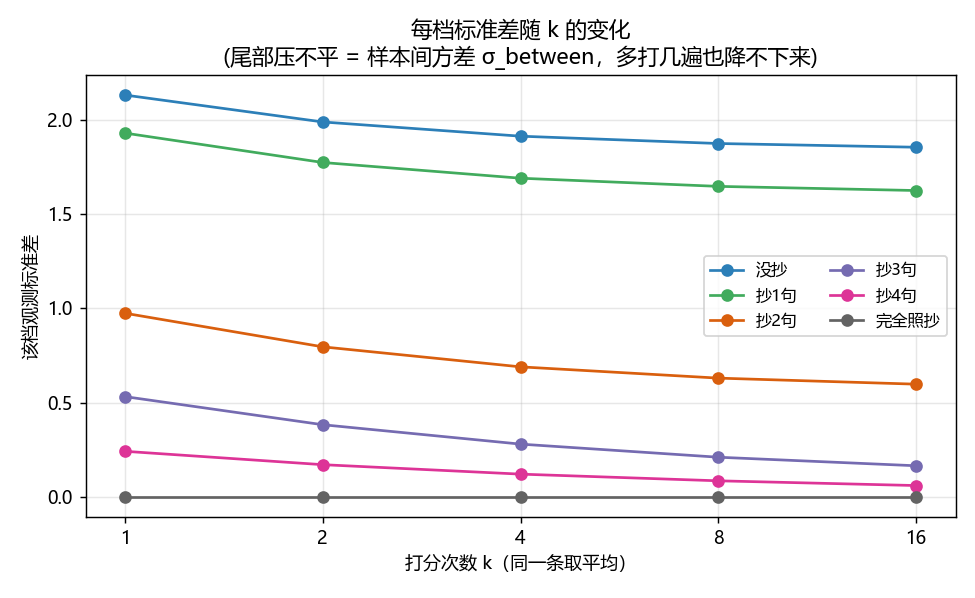
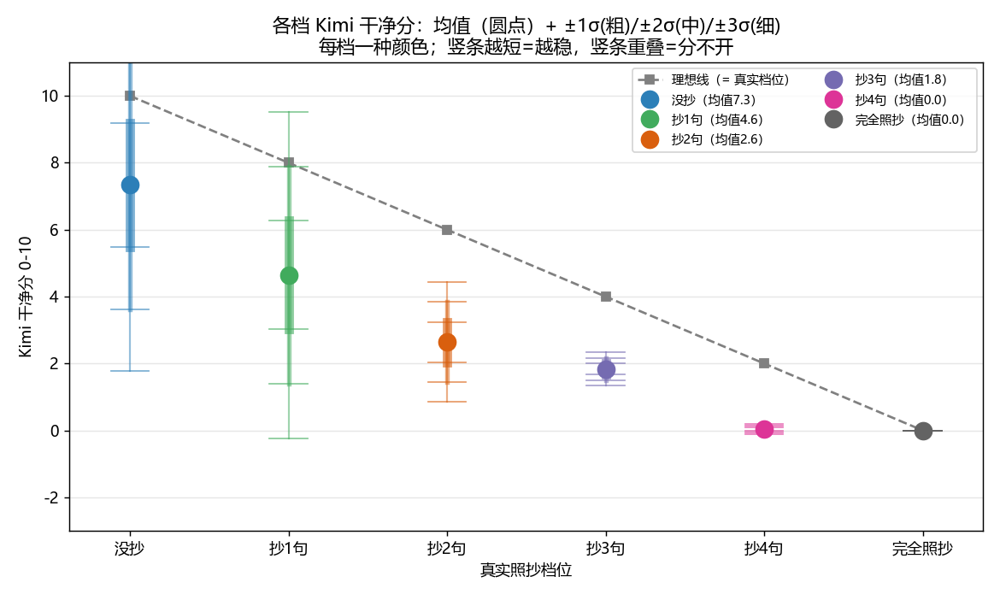
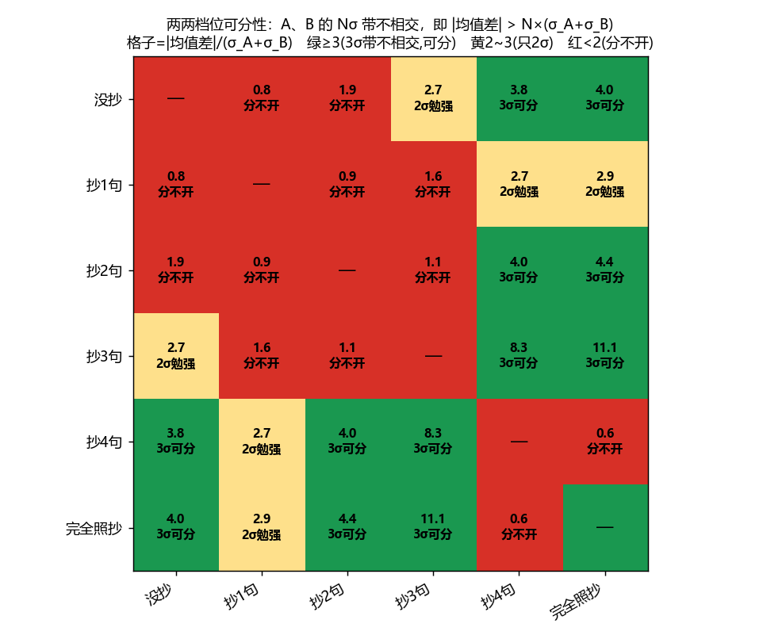

# judgecal 实验报告 · Kimi 换词复述分辨率（全中文重做）

> 数据：78 条 think（13 个参考 × 6 档，每档 13 条），每条 Kimi 打 0-10 干净分 16 遍。
> "干净分"：10=完全没换词复述照抄，0=整段都是照抄。

## 0. "客观锚点"是什么
人为定的"理想分标尺"：没抄=10、每多抄一句降 2 分、完全照抄=0。**只当对照线**（图里灰虚线），看 Kimi 比理想偏多少。**判两档分不分得开完全不靠它**，只比 Kimi 的实际打分分布（第 3、4 节）。

## 1. 整体评测精度（N×k）—— 以后比模型阶段用
评测一个模型整体干净度 = 让 Kimi 给 N 条各打 k 次、取总平均。这个平均值有多准（标准误 SE）：

> **公式**： SE = σ_total / √N ， 其中 σ_total = √(σ_between² + σ_judge²/k)
> 代入本次实测代表值 σ_between≈1.02、σ_judge≈0.74（各档均方根）。

| 样本量 N | k=1 | k=3 | k=16 |
|---|---|---|---|
| 50 | 0.179 | 0.157 | 0.147 |
| 100 | 0.126 | 0.111 | 0.104 |
| 200 | 0.089 | 0.078 | 0.073 |
| 224 (验收集) | 0.084 | 0.074 | 0.069 |
| 500 | 0.056 | 0.050 | 0.046 |

**怎么用 / 关键结论**：
- 两个模型阶段的平均干净分，差距要 **> 约 3×SE** 才算真涨（不是噪声）。例：N=224、k=1 时 SE≈0.084，所以**两阶段平均差 > ~0.25 分**才可信。
- **k 几乎不影响整体评测**（N=224 时 k=1→16 只把 SE 从 0.084 压到 0.069）——因为整体评测的瓶颈是样本间方差 σ_between，它靠 √N 摊薄、不靠 k。**所以整体评测用大 N、小 k（k=1~3）就够，别浪费 16 倍调用。**
- 注意这跟"逐条选样"相反：选 DPO 对子是逐条判，σ_between 没 N 可摊、k 也压不掉（见第 2 节）。

## 2. 每档方差（含均值）+ 随 k 变化
两块方差：**σ_judge**=同一条反复打的噪声（k 能压）；**σ_between**=同档不同样本 Kimi 自己就不一致（**k 压不掉、真天花板**）。观测 std@k=√(σ_between²+σ_judge²/k)。

| 真实档位 | 客观锚点 | Kimi均值 | σ_judge(单遍噪声,k可压) | σ_between(样本间,k压不掉) | k=1观测std | k=2观测std | k=4观测std | k=8观测std | k=16观测std |
|---|---|---|---|---|---|---|---|---|---|
| 没抄 | 10 | 7.34 | 1.08 | 1.84 | 2.13 | 1.99 | 1.91 | 1.87 | 1.85 |
| 抄1句 | 8 | 4.64 | 1.07 | 1.60 | 1.93 | 1.77 | 1.69 | 1.65 | 1.63 |
| 抄2句 | 6 | 2.64 | 0.79 | 0.56 | 0.97 | 0.80 | 0.69 | 0.63 | 0.60 |
| 抄3句 | 4 | 1.84 | 0.52 | 0.10 | 0.53 | 0.38 | 0.28 | 0.21 | 0.17 |
| 抄4句 | 2 | 0.03 | 0.24 | 0.00 | 0.24 | 0.17 | 0.12 | 0.09 | 0.06 |
| 完全照抄 | 0 | 0.00 | 0.00 | 0.00 | 0.00 | 0.00 | 0.00 | 0.00 | 0.00 |

**读出**：干净端（没抄/抄1）σ_between≈1.8/1.6，k=1→16 几乎没降——顶端飘是 Kimi 对干净样本本身忽高忽低，多打也救不了。

## 3. 各档均值 + ±1/2/3σ（分色，看重叠）

每档一种颜色：圆点=均值，竖条=±1σ(粗)/±2σ(中)/±3σ(细)。**判据就是看两档的 ±3σ 竖条相不相交——不相交才算可分**。一眼看：没抄/抄1/抄2 的竖条大片重叠（分不开）；只有跟竖条几乎缩成一点的 抄4/完全照抄 比，才不相交。

## 4. 两两可分：公式 + 矩阵（判据已改严）
> **判据（A 比 B 干净，要两条 3σ 带不相交）**：可分 ⟺ |均值_A − 均值_B| > 3·(σ_A + σ_B)。
> 矩阵格子 = **|均值差| ÷ (σ_A + σ_B)**（σ 取 k=16 档内标准差，即上表 k=16 列）：**≥3 = 3σ 带不相交(可分✅)，2~3 = 只够 2σ(勉强🟡)，<2 = 分不开❌**。
> 注：这比 Cohen's d 严——d 只看均值隔几个合并 σ、3σ 尾巴仍重叠；这里要求两条 3σ 带整段不沾（误判 ~0.1%）。

|  | 没抄 | 抄1句 | 抄2句 | 抄3句 | 抄4句 | 完全照抄 |
|---|---|---|---|---|---|---|
| **没抄** | — | 0.8❌ | 1.9❌ | 2.7🟡 | 3.8✅ | 4.0✅ |
| **抄1句** | 0.8❌ | — | 0.9❌ | 1.6❌ | 2.7🟡 | 2.9🟡 |
| **抄2句** | 1.9❌ | 0.9❌ | — | 1.1❌ | 4.0✅ | 4.4✅ |
| **抄3句** | 2.7🟡 | 1.6❌ | 1.1❌ | — | 8.3✅ | 11.1✅ |
| **抄4句** | 3.8✅ | 2.7🟡 | 4.0✅ | 8.3✅ | — | 0.6❌ |
| **完全照抄** | 4.0✅ | 2.9🟡 | 4.4✅ | 11.1✅ | 0.6❌ | — |

**你问的"1档2档分不开，那1档4档呢"**：抄1↔抄2 = 0.9（分不开）；抄1↔抄4 = 2.7（2σ勉强——只够 2σ、3σ 不够）。
**相邻档里只有 抄3↔抄4 = 8.3（3σ可分，因两端 σ 都极小）可分**；没抄↔抄1 0.8、抄1↔抄2 0.9、抄2↔抄3 1.1、抄4↔完全 0.6 全分不开。
**3σ 可分的全靠"抄4/完全(σ≈0)"那端**：没抄↔抄4=3.8✅、没抄↔完全=4.0✅、抄2↔完全=4.4✅、抄3↔完全=11.1✅。

## 5. 可分性热力图（三色）

**红=分不开(<2σ)，黄=勉强(2~3σ)，绿=可分(≥3σ)**。格子里写了 σ距离 和判定。对角线是自己跟自己(—)。

## 6. 结论（RL 天花板，按 3σ 带不相交）
- **相邻档里只有 抄3↔抄4 可分**（两端 σ 都极小）；干净端 没抄↔抄1↔抄2 互相全分不开，没抄连抄3 都只够 2σ。Kimi 还会误伤干净（阶段7 病）。
- **抄1句最废**：σ 太大(1.63)，连跟"完全照抄(0 分)"都不够 3σ（2.85）。
- **3σ 可分、又能当 DPO（chosen 干净 vs rejected 脏）的，基本只剩一种：没抄(chosen,分≥~7) vs 抄4句/完全照抄(rejected,分≈0)**。中间一律不用。
- **整体评测（比阶段）不怕这个**：大 N 摊薄即可、k=1~3 足够（§1）。被 σ_between 卡死的是"逐条选对子"。
