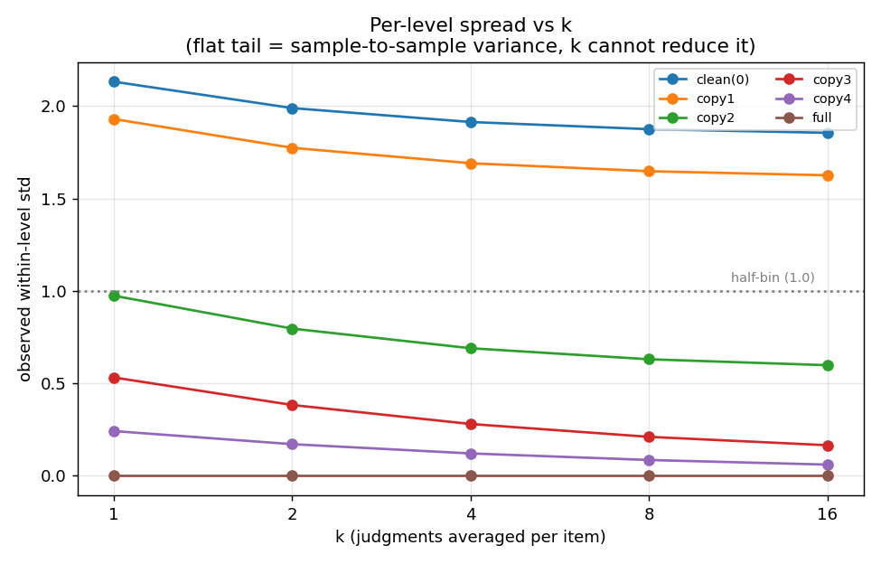
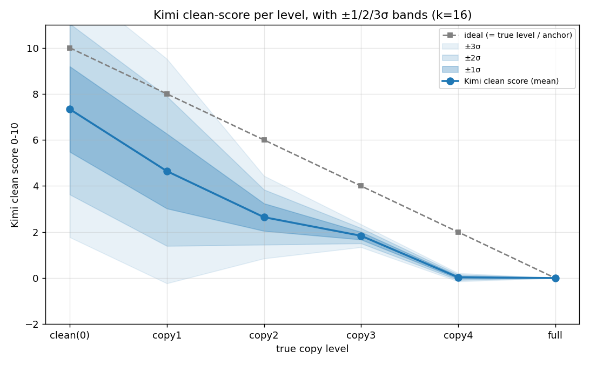

# judgecal 深化分析 · 方差 + σ可分性（按你 4 点重做）

## 0. "客观锚点"是什么意思（先讲清）
**它不是测出来的，是我人为定的"理想分标尺"**：给 6 个真实档位等距赋一个 0-10 分——没抄=10、每多抄一句降 2 分、完全照抄=0。**只用来当"如果 Kimi 完美、它该打的分"那条对照线**（图里的灰虚线）。
**关键：判"两档分不分得开"完全不靠这个锚点**——只比 Kimi 在两档上的实际打分分布（下面第 3 节）。锚点只是让你直观看到"Kimi 比理想偏低多少、在哪压平"。

## 1. 方差：按"档位 × k"拆开（你的第 1 点）
把方差拆成两块：**σ_judge**=同一条反复打的噪声（打几遍 k 能压掉，σ/√k）；**σ_between**=同一档不同样本之间 Kimi 自己就不一致（**k 压不掉、是真天花板**）。观测到的档内 std@k = √(σ_between² + σ_judge²/k)。

| 真实档位 | 客观锚点 | σ_judge(单遍噪声,k可压) | σ_between(样本间,k压不掉) | k=1观测std | k=2观测std | k=4观测std | k=8观测std | k=16观测std |
|---|---|---|---|---|---|---|---|---|
| 没抄 | 10 | 1.08 | 1.84 | 2.13 | 1.99 | 1.91 | 1.87 | 1.85 |
| 抄1句 | 8 | 1.07 | 1.60 | 1.93 | 1.77 | 1.69 | 1.65 | 1.63 |
| 抄2句 | 6 | 0.79 | 0.56 | 0.97 | 0.80 | 0.69 | 0.63 | 0.60 |
| 抄3句 | 4 | 0.52 | 0.10 | 0.53 | 0.38 | 0.28 | 0.21 | 0.17 |
| 抄4句 | 2 | 0.24 | 0.00 | 0.24 | 0.17 | 0.12 | 0.09 | 0.06 |
| 完全照抄 | 0 | 0.00 | 0.00 | 0.00 | 0.00 | 0.00 | 0.00 | 0.00 |

**读出**：干净端（没抄/抄1）的 σ_between ≈ 1.8/1.6，**打到 k=∞ 也下不来**——所以顶端的飘不是"打得不够多"，是 Kimi 对干净/轻度样本本身就判得忽高忽低。脏端（抄4/完全）σ 几乎 0（都砸到 0 分）。

## 2. 曲线 + 1/2/3σ 带（你的第 2 点）

蓝色三层带 = mean±1σ / ±2σ / ±3σ（k=16）。可以直接看哪两档的带子叠在一起（=分不开）。

## 3. 到底哪档和哪档分得开：全档两两 σ 距离矩阵（你的第 3、4 点）
**判据**：两档可分性 = |两档均值差| ÷ 合并标准差 = **σ距离**（即 Cohen's d）。
- **<2σ**：分不开（带子大面积重叠）；**2~3σ**：勉强；**≥3σ**：干净可分。

|  | clean(0) | copy1 | copy2 | copy3 | copy4 | full |
|---|---|---|---|---|---|---|
| **没抄** | — | 1.5 | 3.4 | 4.2 | 5.6 | 5.6 |
| **抄1句** | 1.5 | — | 1.6 | 2.4 | 4.0 | 4.0 |
| **抄2句** | 3.4 | 1.6 | — | 1.8 | 6.1 | 6.3 |
| **抄3句** | 4.2 | 2.4 | 1.8 | — | 14.5 | 15.7 |
| **抄4句** | 5.6 | 4.0 | 6.1 | 14.5 | — | 0.8 |
| **完全照抄** | 5.6 | 4.0 | 6.3 | 15.7 | 0.8 | — |

**相邻档（你问的"1档2档分不开，那1档4档呢"就看这）**：
- 没抄→抄1句: σ距离 **1.5** → ❌分不开(<2σ)
- 抄1句→抄2句: σ距离 **1.6** → ❌分不开(<2σ)
- 抄2句→抄3句: σ距离 **1.8** → ❌分不开(<2σ)
- 抄3句→抄4句: σ距离 **14.5** → ✅可分(≥3σ)
- 抄4句→完全照抄: σ距离 **0.8** → ❌分不开(<2σ)

**跨档读出**（矩阵里挑关键的）：
- 没抄 vs 抄2句 = **3.4σ** → ✅可分(≥3σ)；没抄 vs 抄4句 = **5.6σ** → ✅可分(≥3σ)。
- 抄1句 vs 抄2句 = 1.6σ（❌分不开(<2σ)）；抄1句 vs 抄4句 = **4.0σ** → ✅可分(≥3σ)。
- 抄2句 vs 完全照抄 = **6.3σ** → ✅可分(≥3σ)。

## 4. 结论（RL 天花板）
- **相邻档基本都分不开**（只有抄3→抄4 跨过 2σ）；干净端因 σ_between 太大、k 压不掉，**没抄 vs 抄1/抄2 都分不开** → Kimi 会把干净/轻度照抄混作一谈、还误伤干净（阶段7 病）。
- **要拉到隔 2~3 档、且一端是"重度照抄"，才稳过 2σ**（如没抄 vs 抄4、抄2 vs 完全）。
- **对训练**：只能用"基本干净 vs 重度照抄(≥4句)"这种**大间距对子**；0~2 句的细分、以及"干净 vs 轻度"，Kimi 在当前精度下给不出可靠梯度。打更多遍 k 也救不了（瓶颈是 σ_between，不是噪声）。
